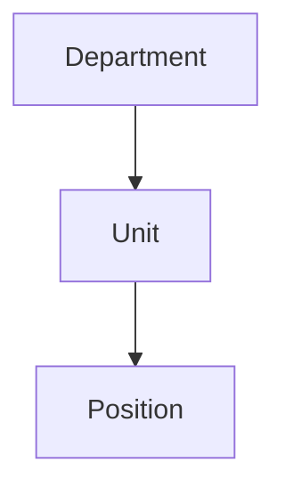
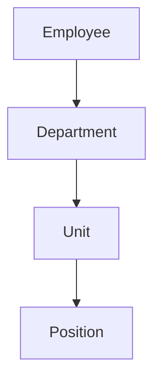
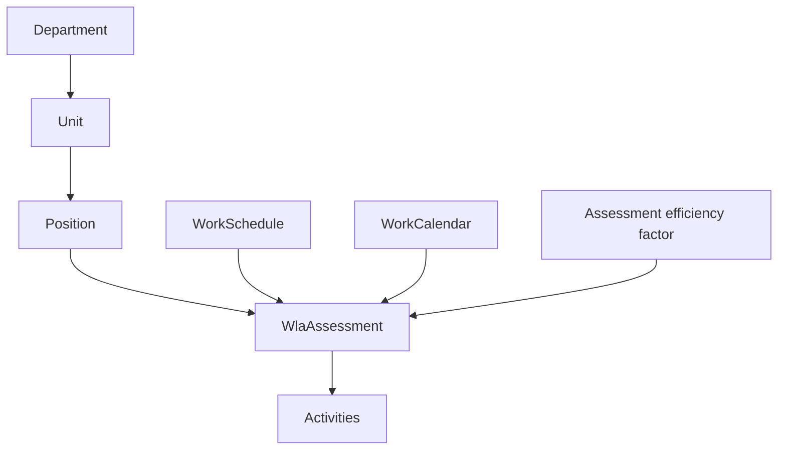
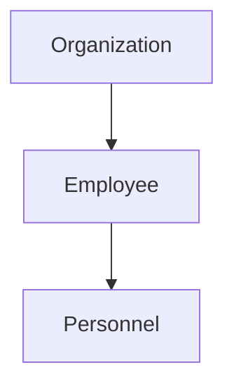
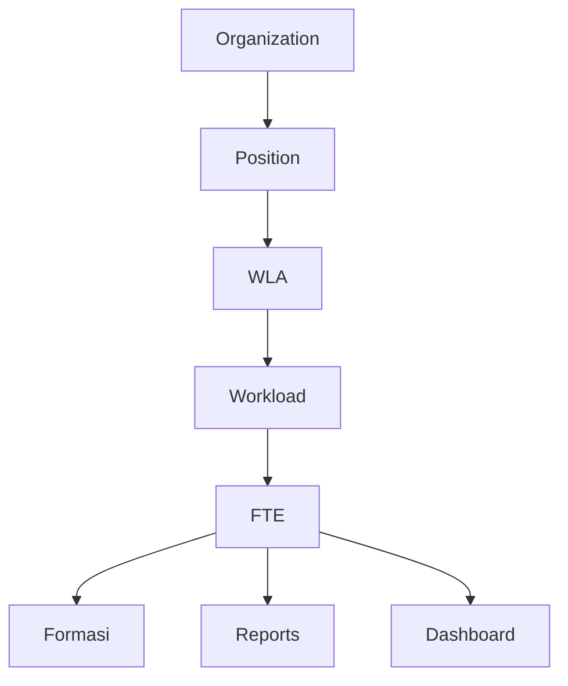

# Arsitektur HCM

## 1. Project Overview

Repository ini adalah aplikasi Laravel 13.33 dengan PHP 8.3, Blade, Tailwind CSS, Alpine.js, Vite, Eloquent, Laravel Breeze, dan PHPUnit. Dependensi frontend menggunakan Vite 8, Tailwind CSS 3, dan Alpine.js 3; package tambahan tidak diperlukan untuk persiapan arsitektur ini.

Aplikasi saat ini menggabungkan halaman dashboard dan beberapa screen HCM dengan operasi pegawai, mutasi, promosi, demosi, administrasi user, dan WLA draft assessment/activity. Perhitungan workload dan FTE belum tersedia.

## 2. Current Architecture

- HTTP: controller di `app/Http/Controllers`, route web di `routes/web.php`, dan route autentikasi Breeze di `routes/auth.php`.
- Input: beberapa Form Request Breeze tersedia, ditambah Form Request Employee dan Personnel Action yang sekarang memusatkan validasi.
- Domain: Eloquent model berada langsung di `app/Models`; role didefinisikan oleh `App\Enums\UserRole`.
- Operasi file: import CSV/XLSX berada di `app/Imports`; export pegawai berada di `app/Exports`.
- UI: Blade berbasis halaman berada di `resources/views/pages`, dengan halaman autentikasi, dashboard, profil, layout, dan komponen terpisah.
- Data: migration mencakup users, employees, mutasi/promosi/demosi, approval, cache, jobs, master departments/units/positions, master work schedules/calendars, dan FK Organization nullable pada Employee.
- Kualitas: feature tests meliputi authentication, pegawai, mutasi, promosi, demosi, user, profil, Organization, dan workforce master. Policy tersedia untuk Organization serta Work Schedule/Work Calendar; service workforce saat ini hanya menangani perhitungan hari kerja dan jam kerja dasar.

Model mutasi, promosi, dan demosi memiliki relasi `approvals()`. Masing-masing approval memiliki relasi ke aksi dan user manager. Employee kini memiliki FK nullable ke Department, Unit, dan Position serta tetap mempertahankan field teks lama.

## 3. Domain Map

| Domain target | Struktur aktual | Status |
| --- | --- | --- |
| Dashboard | `DashboardController`, `dashboard.blade.php` | Ada; angka statistik masih statis. |
| Employees | `Employee`, `EmployeeController`, `EmployeeImport`, `EmployeeSpreadsheet` | Ada; FK Organization nullable dengan field teks legacy untuk transisi. |
| Organization | Department, Unit, Position; controller di `app/Http/Controllers/Organization` | Master hierarchy sudah tersedia; Employee belum memakai foreign key ke master. |
| Personnel | `EmployeeMutation`, `EmployeePromotion`, `EmployeeDemotion`, approval models, controllers, imports | Ada; workflow persetujuan menggunakan service bersama. |
| WLA | Draft `WlaAssessment` dan `WlaActivity`, CRUD di `/wla` | Input dan persistence tersedia; belum ada annual workload/FTE calculation atau approval workflow. |
| Workforce | Master `WorkSchedule` dan `WorkCalendar` dengan CRUD; Formasi dan Definitif masih placeholder | Master berdiri sendiri; belum terhubung ke Employee atau WLA. |
| Reports | Route/view Laporan berupa placeholder | Belum ada report service atau pipeline laporan. |
| Users / Administration | `User`, `UserRole`, `UserManagementController`, Breeze auth | Ada; aturan pengelolaan role sebagian di enum dan controller. |

Nama dan URL existing dipertahankan. Domain target adalah tujuan organisasi, bukan instruksi untuk mengganti nama class, route, atau view yang sudah dipakai.

## 4. Folder Structure

Struktur aktual yang relevan:

```text
app/
  Enums/
  Exports/
  Http/Controllers/Organization/
  Http/Requests/
  Imports/
  Models/
  Policies/
  Services/Personnel/
  Services/Workforce/
database/
  migrations/
  seeders/
resources/views/
  auth/
  components/
  employees/
  layouts/
  organization/
  pages/
  profile/
routes/
  auth.php
  web.php
tests/Feature/
```

Struktur ini cukup untuk tahap sekarang. Route dan Blade tidak dipindahkan hanya demi menyerupai struktur target. Modul baru sebaiknya menggunakan folder domain saat mulai dibangun, tanpa memindahkan view lama secara massal.

## 5. Controller Responsibility

Controller menerima request, memeriksa akses, memanggil Form Request/import/service, lalu mengembalikan view, redirect, atau download. Refactor tahap ini memindahkan proses persetujuan tiga manager dari tiga controller ke service dan validasi payload dari controller ke Form Request.

Controller Personnel masih memuat pencarian daftar, statistik, dan pembuatan dokumen Word. `UserManagementController` juga masih mengandung parsing spreadsheet dan alur import; pemindahan bagian-bagian ini ditunda karena berisiko mengubah format atau hasil import.

## 6. Service Responsibility

`ApprovalService` menjalankan transaksi, row lock, pencatatan approval unik per manager, penghitungan quorum tiga approval, dan finalisasi untuk mutasi, promosi, serta demosi. Controller tetap mengotorisasi role dan memilih pesan respons.

Service ditambahkan ketika ada aturan bisnis yang nyata. `WorkCalendarService` menangani hitungan hari/jam kalender dasar dan effective hours dengan faktor sebagai argumen; service ini bukan WLA calculation engine. Belum ada WLA, report, atau employee service.

## 7. Model Responsibility

Model mewakili tabel dan relasi Eloquent. Relasi approval sudah tersedia dan dipakai melalui eager loading. Model Department memiliki banyak Unit dan Employee; Unit milik Department, memiliki banyak Position dan Employee; Position milik Unit dan memiliki banyak Employee. Employee belongsTo Department melalui `department_id`, Unit melalui `unit_id`, dan Position melalui `position_id`.

Nama atribut teks legacy `department` dan `position` berkonflik dengan method relationship bernama sama. Karena Eloquent akan tetap mengembalikan attribute dari `$employee->department` / `$employee->position`, tampilan serta eager loading menggunakan alias `organizationDepartment` dan `organizationPosition`. Method label menyediakan nama master dengan fallback ke teks lama. Field `department`, `bureau`, `section`, `organizational_unit`, dan `position` tidak dihapus.

Sebelum merancang relasi baru, sepakati identitas unit/posisi, sumber data organisasi, sejarah perubahan, dan pemetaan data existing. Jangan mengubah tabel Employee sebagai bagian dari persiapan WLA ini.

## 8. Authorization

Semua route aplikasi operasional berada di middleware `auth`. Akses khusus saat ini diperiksa dalam controller/Form Request, belum melalui policy atau middleware role terpusat.

- Super Admin: edit/hapus personnel records, cetak dokumen final, import dan pengelolaan pegawai, serta pengelolaan seluruh role.
- Admin/Manager: menyetujui mutasi/promosi/demosi; Admin dan Manager dapat mengelola sebagian user sesuai enum dan controller.
- Employee create sekarang dibatasi server-side ke Super Admin, sama seperti update, import, dan delete; sebelumnya hanya UI yang membatasi form create.
- Pembuatan dan import mutasi/promosi/demosi tersedia bagi setiap user terautentikasi sesuai perilaku test existing. Perubahan role untuk endpoint ini perlu keputusan bisnis, bukan perubahan asumtif.
- UI boleh menyembunyikan aksi, tetapi perlindungan server tetap menjadi kontrol otoritatif. Jalur update/delete/approval/import yang diperiksa sudah memiliki pemeriksaan server-side sesuai aturan di atas.
- Registrasi Breeze masih terbuka untuk guest. Migration memberi default role `Pegawai`, sementara `UserRole` tidak memiliki case tersebut dan `roleEnum()` memetakannya ke fallback `Staff`. Jangan mengubah default atau menutup registrasi tanpa keputusan akses produk dan rencana kompatibilitas data.

## 9. Route Organization

`routes/web.php` memuat 63 route termasuk Breeze, dashboard, semua domain, alias pegawai, dan profil. Memisahkan route sekarang berpotensi mengubah nama, urutan, atau URL; karena itu file domain belum dibuat. Route domain baru dapat ditambahkan terpisah ketika kontrak URL dan nama route jelas, kemudian di-load dari `web.php` tanpa mengubah route existing.

## 10. View Organization

Halaman fitur existing terkonsentrasi di `resources/views/pages`; halaman Organization baru berada di `resources/views/organization/{departments,units,positions}`. Beberapa view existing masih berupa placeholder. Tidak ada pemindahan besar pada tahap ini.

Blade personnel menghitung jumlah approval dan status approval user dari koleksi yang eager-loaded. Query daftar sudah menggunakan `with('approvals')`, sehingga jalur ini tidak menunjukkan N+1 untuk approval; perhitungan status tersebut tetap layak dipindahkan dari template saat UI/workflow berikutnya dikerjakan. Kondisi role di Blade hanya mengatur presentasi.

## 11. Testing

Jalankan semua test dengan `php artisan test --compact`, dan gunakan file feature terkait untuk iterasi sempit. Test existing mencakup CRUD, import/export, approval tiga manager, print, dan pemeriksaan role. Test tambahan memverifikasi Employee create/update request serta penolakan Admin di endpoint create.

Baseline sebelum integrasi Employee Organization adalah 73 dari 75 test lulus. Dua failure yang sudah ada: assertion teks pada template print demosi (`Surat demosi`) dan pembandingan tanggal import Employee yang memformat nilai date berbeda pada SQLite. Failure ini bukan akibat integrasi.

## 12. Organization Master

Master organisasi menyediakan hierarchy minimum Department → Unit → Position, sebagai sumber relasi yang dapat digunakan Employee dan WLA pada tahap berikutnya. Department memiliki `code`, `name`, `active`; Unit memiliki FK `department_id`; Position memiliki FK `unit_id`. Semua tabel memiliki `id` dan timestamps.

Foreign key parent menggunakan `restrictOnDelete`, bukan cascade delete, agar penghapusan parent tidak menghapus unit/position secara berantai. Controller juga menolak penghapusan parent yang masih memiliki child. Department `code` unik global; Unit `code` unik per `department_id`; Position `code` unik per `unit_id`. Unique index gabungan Unit dan Position juga mengindeks foreign key parent.



Policy Department, Unit, dan Position mengizinkan hanya Super Admin untuk melihat dan mengelola master. Otorisasi dijalankan di controller melalui Laravel Gate, bukan sekadar menyembunyikan tautan. Route resource baru berada di prefix `/organization` dan group `auth` yang sudah ada.

Hierarchy ini dipilih karena hanya tiga tingkat tersebut yang diperlukan sebagai dasar posisi kerja, sementara `bureau` dan `section` hanya ditemukan sebagai kolom Employee dan bukan level organisasi konsisten lintas domain. Keduanya serta field teks Employee lain tetap utuh.

Migration additive `add_organization_ids_to_employees_table` menambahkan nullable `department_id`, `unit_id`, dan `position_id` dengan foreign key berindeks dan `ON DELETE SET NULL`. Rollback hanya melepas tiga FK dan kolom baru tersebut. Tidak ada migration Employee lama yang diubah, dan field teks legacy tetap tersedia.

Nama Department, Unit, dan Position ditentukan berdasarkan exact match dahulu, lalu normalized exact yang mengabaikan case dan whitespace berulang. Unit dan Position dipadankan dalam parent yang telah diketahui; jika parent name tidak tersedia, nama child hanya dipakai bila unik global dan parent existing dapat diinferensikan. Nama child berulang, nama yang cocok hanya pada parent berbeda, atau pasangan legacy yang saling bertentangan dilaporkan sebagai conflict. Tidak ada fuzzy match atau pembuatan master otomatis.

Laporan dan dry-run default:

```sh
php artisan employees:map-organization --dry-run
php artisan employees:map-organization --dry-run --chunk=200
```

Command menampilkan total Employee, mapped/unmapped/empty per tingkat, jumlah conflict, dan employee ID/personnel number yang perlu ditinjau. Dry-run tidak mengubah data.

Setelah owner data meninjau seluruh conflict/unmapped dan data master yang benar telah diisi:

```sh
php artisan employees:map-organization --apply --chunk=200
```

Apply menggunakan chunking dan transaksi per chunk, hanya mengisi FK yang masih null, tidak mengubah field teks, tidak menimpa foreign key yang telah diisi, dan melewati record conflict. Unmatched dapat diperbaiki pada sumber/master lalu dry-run ulang; jangan membuat master baru dari string employee tanpa review dan persetujuan.

Import Employee lama menerima kolom text organisasi dan meresolve ke master yang ada. Unmatched/conflict menggagalkan transaksi import dengan nomor baris; importer tidak membuat Department/Unit/Position. Update parent sebagian yang dapat membuat hierarchy silang juga ditolak.

## 13. Employee Organization Integration



Master FKs nullable mendukung roll-out bertahap: record termigrasi memakai relasi; record belum termigrasi terus memakai `department`, `organizational_unit`, dan `position` sebagai fallback. Form Employee dan filter baru menggunakan FK, validasi server menolak kombinasi parent-child yang salah, dan import/export/print menampilkan nama master jika tersedia tanpa menghilangkan teks legacy.

Dry-run MySQL pada tahap ini melaporkan **30 Employee; mapped Department/Unit/Position 0/0/0; unmapped 30/30/30; conflicts 0; empty text 0/0/0; updated 0**. Tabel master belum memiliki data, sehingga tidak ada backfill yang dijalankan. Angka ini adalah snapshot environment; ulangi dry-run setelah master aktual tersedia.

FK Employee memakai `ON DELETE SET NULL`; menghapus referensi tidak menghapus Employee atau teks legacy. Unit/Position tidak dapat dipindah ke parent berbeda selama masih terhubung ke Employee.

## 14. WLA Excel Traceability

Workbook yang diverifikasi adalah `storage/app/import/A. Form WLA.xlsx`, SHA-256 `CFEDFA1C95024FC8CE3CA6BD15AC9D37A5C49E0FEFFE3D83491FB82115CCB09D`.

| Worksheet | XLSX part | Used range | Formulas | Merged cells | Data validations |
| --- | --- | --- | ---: | ---: | ---: |
| A. Form WLA | `xl/worksheets/sheet1.xml` | `A1:W71` | 18 | 17 | 3 |
| Tabel Posisi | `xl/worksheets/sheet2.xml` | `A2:D265` | 0 | 0 | 0 |

Defined name: `_xlnm.Print_Area = 'A. Form WLA'!$A$12:$N$69`. The cached values below are exactly those stored in the workbook; no workbook recalculation or editing was performed.

### Input and Derived Values

**Input/master:** schedule references `G13=7`, `G16=7.5`, `G17=6.5`, `G18=8.5`, `G22=10`, `G23=10`; days/week `G14=5`, `G20=6`, `G25=4`; selected daily hours `C19` (blank in this template); total days `C21=366`; total weeks `C22=52`; annual leave `C23=12`; common leave `C25=6`; efficiency factor `C30=0.90`. Calendar holiday/weekend cells are formula-derived, not independent input cells.

**Derived:** schedule weekly hours (`H14`, `H19`, `H20`, `H24`, `H25`), selected weekly hours (`C20`), national holiday/Sunday/Saturday (`C24`, `C26`, `C27`), working days (`C28`), annual working hours (`C29`), effective hours (`C31`), and month/week/day breakdown (`C32:C34`). Derived values are not stored as master fields.

### Schedule Mapping

| Excel schedule/source | `work_schedules.code` | Name / type | Hours/day | Days/week | Hours/week |
| --- | --- | --- | ---: | ---: | ---: |
| Dayshift: `F12`, `G13`, `G14` | `DAYSHIFT` | Dayshift / Dayshift | 7.00 | 5 | 35.00 (`H14`) |
| Shift 1: `F16`, `G16`, group `G20` | `SHIFT_1` | Shift 1 / Shift 1/2/3 | 7.50 | 6 | 45.00 |
| Shift 2: `F17`, `G17`, group `G20` | `SHIFT_2` | Shift 2 / Shift 1/2/3 | 6.50 | 6 | 39.00 |
| Shift 3: `F18`, `G18`, group `G20` | `SHIFT_3` | Shift 3 / Shift 1/2/3 | 8.50 | 6 | 51.00 |
| Shift 7/7: instruction `A5`, group `F21`, days `G25` | `SHIFT_7_7` | Shift 7/7 / Shift 7/7 | 10.00 | 4 | 40.00 (`H25`) |
| Shift 7/19: `F22`, `G22`, group `G25` | `SHIFT_7_19` | Shift 7/19 / Shift 7/7 | 10.00 | 4 | 40.00 (`H24` group) |
| Shift 19/7: `F23`, `G23`, group `G25` | `SHIFT_19_7` | Shift 19/7 / Shift 7/7 | 10.00 | 4 | 40.00 (`H24` group) |

`WorkSchedule.working_hours_per_day` is `DECIMAL(5,2)` after an additive migration; the original create-table migration is unchanged. `working_hours_per_week` is a computed, non-persisted decimal: hours/day multiplied by days/week. The seeder uses stable codes and only these seven verified schedules; `updateOrCreate` makes it idempotent. No Work Calendar production rows are seeded because these are template values, not authoritative year-specific data.

The overview instruction in `A5` summarizes Shift 1/2/3 as 7.5 hours/day, while its detailed reference cells `G16:G18` list 7.5, 6.5, and 8.5 separately. The master seed follows those detailed named-shift values. The template's `C20` IFS formula checks the group average `G19=7.5`, not the individual 6.5/8.5 values; selecting Shift 2 or Shift 3 therefore cannot match a branch and may produce `#N/A`. The application master still computes their weekly hours as 39 and 51 from each schedule's actual values; this does not rewrite the Excel formula.

### Formula Traceability

| Concept | Excel cell | Formula → cached result | Application target | Business meaning |
| --- | --- | --- | --- | --- |
| Dayshift weekly hours | `H14` | `=G14*G13` → `35` | `WorkSchedule.working_hours_per_week` | 5 workdays × 7 hours/day. |
| Shift 1/2/3 average | `G19` | `=AVERAGE(G16:G18)` → `7.5` | Individual Work Schedule rows retain each daily value | Excel form uses a group average for schedule selection. |
| Shift 1/2/3 group weekly hours | `H19` | `=G19*6` → `45` | Computed weekly hours | 7.5 × six days. |
| Selected weekly hours | `C20` | `=_xlfn.IFS(C19=G13,H14,C19=G19,H20,C19=G24,H25)` → cached `#N/A` | Future schedule selection; no assessment flow here | `C19` is blank, so no branch matches. The formula also has no branch for individual 6.5/8.5-hour Shift 2/3 selections. Source formula issue, not a business value. |
| Shift group weekly hours | `H20` | `=G20*G19` → `45` | Computed weekly hours | Six days × the displayed group average. Individual master outputs are 45, 39, and 51. |
| 7/19 and 19/7 average daily hours | `G24` | `=AVERAGE(G22:G23)` → `10` | `WorkSchedule.working_hours_per_day` | Group average. |
| 7/19 and 19/7 weekly hours | `H24` | `=G24*4` → `40` | Computed weekly hours | 10 × four days. |
| 7/7 weekly hours | `H25` | `=G25*G24` → `40` | Computed weekly hours | 10 × four days; 10-hour value is stated in `A5`. |
| National holiday | `C24` | `=IF(C19=7,17,0)` → cached `0` | `WorkCalendar.national_holiday`, conditionally used by service | 17 applies only when template hours/day equals 7. |
| Sunday | `C26` | `=IF(C19=7,52,0)` → cached `0` | `WorkCalendar.sunday_days`, conditionally used by service | 52 applies only at 7 hours/day. |
| Saturday | `C27` | `=IF(C19=7,52,0)` → cached `0` | `WorkCalendar.saturday_days`, conditionally used by service | 52 applies only at 7 hours/day. |
| Working days | `C28` | `=C21-C23-C24-C25-C26-C27` → cached `348`; with Dayshift → `227` | `WorkCalendarService.calculateWorkingDays()` | Subtract annual leave, conditional holiday, common leave, conditional Sunday/Saturday; floor at zero. |
| Working hours/year | `C29` | `=C28*C19` → cached `0`; with Dayshift → `1589` | `WorkCalendarService.calculateWorkingHoursPerYear()` | Working days × hours/day; returned as a two-decimal string. |
| Effective working hours/year | `C31` | `=C29*(C30)` → cached `0`; with Dayshift and 90% → `1430.10` | `WorkCalendarService.calculateEffectiveWorkingHours(hours, factor)` | Multiplies by the supplied factor; no global 0.90 constant. |
| Effective hours/month | `C32` | `=C31/12` → cached `0`; Dayshift result → `119.1750` | `WorkCalendarService.calculateEffectiveHoursPerMonth()` | Derived; rounded deterministically to four decimal places. |
| Effective hours/week | `C33` | `=C31/C22` → cached `0`; Dayshift result → `27.5019` | `WorkCalendarService.calculateEffectiveHoursPerWeek()` | Derived using Work Calendar weeks/year. |
| Effective hours/day | `C34` | `=C31/C28` → cached `0`; Dayshift result → `6.3000` | `WorkCalendarService.calculateEffectiveHoursPerDay()` | Derived using calculated working days; zero denominator returns a validation error. |
| Position label copy | `B36` | `=B13` → cached `0` | Draft assessment position context | Copies the position label to the activity section; no workload calculation is implied. |

The service preserves the zero floor. The exact template conditional—apply stored holiday/weekend parameters only when daily hours equal 7—is documented and tested as source-template behavior, not presented as a universal calendar convention.

### Calendar and Activity References

| Concept | Excel source | Application target | Notes |
| --- | --- | --- | --- |
| Total days/year | `C21=366` | `WorkCalendar.total_days` | Template parameter only. |
| Total weeks/year | `C22=52` | `WorkCalendar.total_weeks` | Template parameter only. |
| Annual leave | `C23=12` | `WorkCalendar.annual_leave` | Template parameter only. |
| Common leave | `C25=6` | `WorkCalendar.common_leave` | Template parameter only. |
| Average Efficiency Factor | `C30=0.90`; guidance in `A6` | `wla_assessments.efficiency_factor` | Suggested if installed-equipment efficiency is unavailable; assessment-level and editable, not a schedule/calendar field or global constant. |
| Activity columns | Headers `A37:E38`; example `A39:E39` | `wla_activities` fields | No, Activities, Frequency, Volume, Time Allocated; time unit is Hour. Example: frequency 1, volume Day, 6 hours. |
| Activity volume units | `F28:F31` | `WlaVolumeUnit` | Day, Week, Month, Year; validation on `D39:D1048576`. |
| Frequency reference list | `C67:C69` | `WlaFrequencyUnit` | Day, Week, Month, Year per assessment contract. One workbook list validation points to `#REF!`; application units are validated independently. |

### WLA Foundation Business Rules

1. **Work Schedule:** `WorkSchedule` is the operational source for `working_hours_per_day` and `working_days_per_week`. Hours per week is derived by its computed accessor. Seven workbook-backed master schedules are seeded; weekly hours is never a stored input. Fractional hours use `DECIMAL(5,2)`.
2. **Work Calendar:** `WorkCalendar` holds year-specific calendar inputs. The workbook's 366 days, 12 annual leave days, 6 common leave days, and its conditional 17/52/52 values are template examples, not a production calendar. Official annual values must come from an organization source.
3. **Working Days:** `WorkCalendarService.calculateWorkingDays(WorkCalendar, WorkSchedule)` subtracts annual leave, common leave, and (for code configured as Dayshift) the calendar's national holiday, Sunday, and Saturday values. Other schedule codes use zero for those three conditional deductions. The result is floored at zero. The Dayshift schedule code is centralized in `config/workforce.php`; 17/52/52 remain calendar master values rather than scattered constants.
4. **Working Hours:** `calculateWorkingHoursPerYear()` multiplies calculated working days by the schedule's decimal daily hours. Decimal arithmetic uses scaled integers and returns a two-place decimal string.
5. **Efficiency Factor:** Neither master stores efficiency. Future WLA Assessment owns `efficiency_factor`; 0.90 is the workbook's suggested default only when equipment efficiency is unavailable and must be overridable. The foundation helper accepts an explicit factor in the range 0..1 and does not provide a global default.
6. **Effective Working Hours:** `calculateEffectiveWorkingHours(workingHours, efficiencyFactor)` calculates annual working hours × supplied factor. `calculateEffectiveHoursPerMonth()`, `calculateEffectiveHoursPerWeek()`, and `calculateEffectiveHoursPerDay()` return derived values to four decimal places; a missing denominator is a validation error.
7. **Excel Defects:** The incomplete `C20` IFS and a `#REF!` data validation remain defects in the unmodified workbook. They are not application logic. Missing Work Schedule/Work Calendar objects produce Laravel validation errors, not `#N/A`.
8. **Application Deviations:** Application weekly hours deliberately use each named schedule's own master values, so Shift 2/3 return 39/51 despite Excel `C20` only checking group-average 7.5. This is the normalized, deterministic master rule, not a copy of the incomplete formula.
9. **WLA Assessment Contract:** Draft `wla_assessments` stores `department_id`, `unit_id`, `position_id`, `work_schedule_id`, `work_calendar_id`, period, status, creator, and assessment-level `efficiency_factor`. Draft `wla_activities` stores activity/frequency/volume/time inputs and units. Foundation outputs have nullable snapshot columns and remain unset; annual workload and Required FTE belong to a later stage.

### Template Anomalies and Gate

- **TEMPLATE YEAR / CALENDAR INCONSISTENCY:** `C21=366` while the output labels in `B28:B29` say 2025. This is not treated as an authoritative 2025 calendar; no Work Calendar year is seeded.
- **SOURCE TEMPLATE BEHAVIOR:** `C19` is blank; cached `C20=#N/A`, `C24/C26/C27=0`, `C28=348`, and `C29/C31:C34=0`. For a Dayshift selection, source formulas yield 17 holidays, 52 Sundays, 52 Saturdays, 227 working days, 1589 hours/year, and 1430.10 effective hours at the supplied 90% factor. `#N/A` is not a business value.
- **SOURCE TEMPLATE VALIDATION ISSUE:** a list validation resolves to `#REF!`; it was not corrected in the workbook or translated into application business logic. The overview/detail shift-hours difference and the `C20` missing branches are also retained and documented, not silently repaired.
- **EFFICIENCY DECISION:** the factor is stored on each WLA draft assessment. 0.90 is suggested only when equipment efficiency is unavailable and remains overridable. Work Schedule and Work Calendar have no efficiency field.
- Activity input persistence is now available. Annual workload, Required FTE, and WLA approval remain out of scope.

**Reconciliation gate:** **READY FOR WLA ASSESSMENT.** Foundation business rules are deterministic and covered without inheriting the incomplete `C20` or `#REF!` Excel defects. Preserve those issues in traceability; do not repair or execute the source workbook. The current WLA module persists drafts and activities only; no workload/FTE engine or approval workflow is implemented.

## 15. WLA Assessment

WLA drafts reference the existing Organization, Schedule, and Calendar masters. Each assessment stores master reference IDs and an overridable assessment-level efficiency factor. Snapshot fields for `working_days`, `working_hours_year`, and `effective_working_hours` are nullable and remain empty during draft persistence; the current page may show a read-only preview calculated from the referenced masters, clearly labeled as unsaved. A future finalized historical state must populate snapshots before it is considered immutable.



| Layer | Data | Lifecycle |
| --- | --- | --- |
| Master Data | Department, Unit, Position, Work Schedule, Work Calendar | Independently managed reference records. |
| Assessment | Organization/schedule/calendar references, period, assessment efficiency, creator, draft status, nullable foundation snapshots | Draft-specific. Preview reads current references; snapshots are not calculated or persisted in this stage. |
| Activity Data | Activity name, decimal frequency/unit, decimal volume/unit, decimal allocated time/unit, order, notes | Child records scoped to a draft assessment; units use backed enums. |

Draft mutations use existing `canManageRbac()` roles and server-side policy/Form Request checks. All assessment reference FKs restrict deletion. Activity FK deletion is also restricted; draft deletion explicitly removes activities and the draft in one transaction. Multiple drafts for the same period/position are allowed; no future approval uniqueness rule is imposed.

Assessment codes are generated server-side in a transaction as `WLA-{period}-{id padded to six digits}`. `efficiency_factor` defaults from `config/wla.php` to `0.90`, is stored per assessment, and can be changed; it is not part of Work Schedule or Work Calendar.

The form cascades Department → Unit → Position in Alpine and resets dependent selections when a parent changes. Form Requests independently validate those same relationships against the database. If required masters are absent, draft save is disabled with an explanatory message; no calendar is seeded from template data. The preview uses deterministic `WorkCalendarService` methods but does not write output snapshots. Annual workload, Required FTE, and final approval remain future work.

## 16. Future WLA Architecture

Employee kini dapat dihubungkan ke master Organization. WLA draft inputs now reference that master hierarchy; annual workload and FTE calculations remain future scope.





Tahap WLA berikutnya perlu menyepakati metode pengukuran workload, aturan kalkulasi FTE, approval workflow, serta konsumsi data oleh Formasi/Definitif, Reports, dan Dashboard. Tidak ada kode atau migration WLA yang dibuat dalam tahap ini.

## Risiko dan Batas yang Diketahui

- Migration `2026_09_26_123652_create_employees_table.php` menjalankan `Schema::dropIfExists('employees')` sebelum membuat tabel. Jangan jalankan ulang migration tersebut pada database yang berisi data; history migration tidak diubah dalam audit ini.
- Dashboard dan beberapa halaman lain memakai data statis/placeholder, sehingga belum dapat dianggap sebagai laporan operasional.
- Logika pembentukan dokumen dan parsing import tersebar di controller/import class. Consolidation memerlukan fixture dokumen dan test format tambahan.
- Tidak tersedia metadata `.git` di workspace ini, sehingga baseline diambil dari test suite yang dijalankan sebelum perubahan; diff dan status Git tidak dapat dipakai untuk audit.