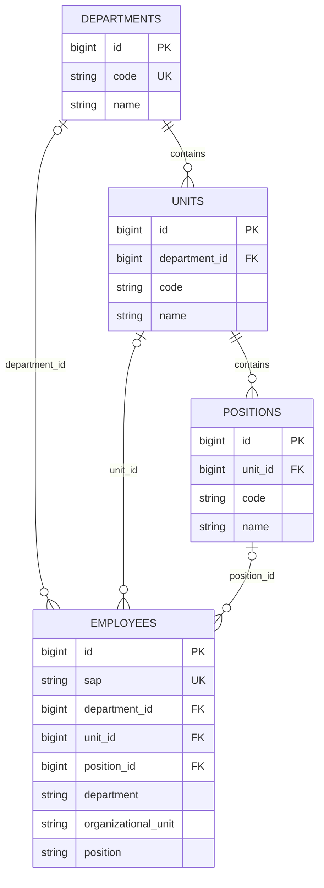

# Employee Data Model Audit

Status: read-only audit and conceptual proposal. No migration, database write, application-code change, import/export change, or Employee data inspection was performed. Runtime evidence below is limited to MySQL schema metadata; no employee rows were queried.

## Scope and evidence

- Workbook: `Kolom(2).xlsx`, inspected from its XLSX package XML. It is a header/data-dictionary reference, not employee source data.
- Runtime schema: read-only `php artisan db:table ... --json` metadata for `employees`, `departments`, `units`, `positions`, and `employee_organization_mapping_audits`.
- Source: Employee model, migrations, requests, controller, importer, spreadsheet exporter, organization mapper/audit, Blade views, and Employee feature tests.
- The schema description distinguishes the currently observed database from what the checked-in migration files would do if applied. Nothing in this audit applies migrations.

## 1. Kolom(2).xlsx data dictionary

| Property | Actual result |
|---|---|
| File size | 99,682 bytes |
| Worksheet count | 1 |
| Worksheet | `Sheet1` |
| Stored row elements / worksheet dimension | 1,073 / `A1:AB1073` |
| Non-empty rows | 1: the header row only |
| Employee data rows | 0 |
| Column count | 28 |
| Header row | Row 1 |
| Blank headers | None |
| Duplicate headers | None, case-insensitive after trimming |
| Formulas | 0 |
| Data validation rules | 0 |
| Defined names | 0 |

The large stored row count/dimension is formatting or otherwise empty worksheet extent; it does not represent 1,072 employee records. No fictional employee data was created or inferred.

Actual headers, in order:

`SAP`, `ID Number`, `AGKN`, `Position id`, `Personal Number`, `Position`, `Employee Subgroup`, `Cost Ctr`, `TXT_DIR`, `TXT_DEPT`, `TXT_BIRO`, `TXT_SECT`, `Birth date`, `Gender Key`, `Personnel Area`, `abrevation position`, `abrevation organization`, `Organizational Unit`, `Cost Center`, `Masa Kontrak`, `E-mail`, `Religious`, `Usia`, `Tempat Lahir`, `Pendidikan`, `Hiring`, `Organilk`, `Alamat`.

This header set is not identical to the importer's accepted header set: the workbook says `Position id` and `Masa Kontrak`, while the importer expects `Position ID` and `Date`. Header validation is exact after whitespace trimming, so the current importer rejects this workbook's header row. The workbook also has no `name` column, while new imported Employees require a usable display name in application code.

## 2. Existing Employee schema

### Runtime schema

The live MySQL metadata reports **54 columns** in `employees`:

| Column | Runtime type | Nullable / constraint | Classification |
|---|---|---|---|
| `id` | `bigint unsigned` | NOT NULL, primary, auto-increment | Application primary key |
| `sap` | `varchar(255)` | NOT NULL, unique | Canonical application identifier |
| `name` | `varchar(255)` | NOT NULL | Canonical display name; absent from workbook |
| `id_number` | `varchar(255)` | NULL | Canonical-form identifier field; no unique constraint |
| `agkn` | `varchar(255)` | NULL | Canonical-form identifier field; no unique constraint |
| `position` | `varchar(255)` | NULL | Position text / legacy display fallback |
| `employee_subgroup` | `varchar(255)` | NULL | Canonical-form employment attribute |
| `cost_center` | `varchar(255)` | NULL | Canonical-form cost-center value |
| `directorate` | `varchar(255)` | NULL | Legacy organization text; no Directorate master |
| `department` | `varchar(255)` | NULL | Legacy organization label / mapping input |
| `bureau` | `varchar(255)` | NULL | Legacy organization text; no Bureau master |
| `section` | `varchar(255)` | NULL | Legacy organization text; no Section master |
| `birth_date` | `date` | NULL | Canonical-form personal date |
| `birth_place` | `varchar(255)` | NULL | Canonical-form personal attribute |
| `gender` | `varchar(255)` | NULL | Canonical-form personal attribute |
| `personnel_area` | `varchar(255)` | NULL | Canonical-form employment attribute |
| `organizational_unit` | `varchar(255)` | NULL | Legacy organization label / mapping input |
| `email` | `varchar(255)` | NULL | Canonical-form contact field |
| `religion` | `varchar(255)` | NULL | Canonical-form personal attribute |
| `age` | `int unsigned` | NULL | Stored integer; recommended derived/display value |
| `education` | `varchar(255)` | NULL | Canonical-form personal attribute |
| `hiring_date` | `date` | NULL | Canonical-form employment date |
| `organic_status` | `varchar(255)` | NULL | Canonical-form status field |
| `address` | `text` | NULL | Canonical-form contact/personal field |
| `created_at` | `timestamp` | NULL | Framework timestamp |
| `updated_at` | `timestamp` | NULL | Framework timestamp |
| `department_id` | `bigint unsigned` | NULL; FK to `departments.id`, ON DELETE SET NULL | Organization master FK |
| `unit_id` | `bigint unsigned` | NULL; FK to `units.id`, ON DELETE SET NULL | Organization master FK |
| `position_id` | `bigint unsigned` | NULL; FK to `positions.id`, ON DELETE SET NULL | Organization master FK |
| `ID Number` | `varchar(255)` | NULL | Raw SAP header field |
| `Position ID` | `varchar(255)` | NULL | Raw SAP header field; not the application FK |
| `Personal Number` | `varchar(255)` | NULL | Raw SAP header field |
| `Employee Subgroup` | `varchar(255)` | NULL | Raw SAP header field |
| `Cost Ctr` | `varchar(255)` | NULL | Raw SAP header field |
| `TXT_DIR` | `varchar(255)` | NULL | Raw SAP hierarchy label |
| `TXT_DEPT` | `varchar(255)` | NULL | Raw SAP hierarchy label |
| `TXT_BIRO` | `varchar(255)` | NULL | Raw SAP hierarchy label |
| `TXT_SECT` | `varchar(255)` | NULL | Raw SAP hierarchy label |
| `Birth date` | `date` | NULL | Raw SAP header field |
| `Gender Key` | `varchar(255)` | NULL | Raw SAP header field |
| `Personnel Area` | `varchar(255)` | NULL | Raw SAP header field |
| `abrevation position` | `varchar(255)` | NULL | Raw SAP header field; spelling as implemented |
| `abrevation organization` | `varchar(255)` | NULL | Raw SAP header field; spelling as implemented |
| `Organizational Unit` | `varchar(255)` | NULL | Raw SAP organization label |
| `Cost Center` | `varchar(255)` | NULL | Raw SAP header field |
| `Date` | `date` | NULL | Legacy/raw importer field; not present in this workbook |
| `E-mail` | `varchar(255)` | NULL | Raw SAP header field |
| `Religious` | `varchar(255)` | NULL | Raw SAP header field |
| `Usia` | `int unsigned` | NULL | Raw SAP age snapshot |
| `Tempat Lahir` | `varchar(255)` | NULL | Raw SAP header field |
| `Pendidikan` | `varchar(255)` | NULL | Raw SAP header field |
| `Hiring` | `date` | NULL | Raw SAP header field |
| `Organilk` | `varchar(255)` | NULL | Raw SAP header field; spelling as implemented |
| `Alamat` | `text` | NULL | Raw SAP header field |

The runtime table has indexes on each organization FK and the unique index on `sap`; no unique index was reported for `id_number`, `agkn`, `Personal Number`, or `ID Number`. The previous `personnel_no` column is absent from the runtime table.

### Migration history and code contract

- The initial Employee migration creates `personnel_no` as required/unique and the canonical snake_case fields. `2026_09_29_000001_rename_personnel_no_to_sap_on_employees_table.php` performs the rename and makes `sap` unique; `2026_09_29_021444_rename_personnel_no_to_sap_on_employees_table.php` is an empty no-op. Runtime metadata confirms `sap` is the current column. This corrects the two migration filenames that were reversed in the initial audit text.
- `2026_09_27_114941_add_organization_ids_to_employees_table.php` adds nullable `department_id`, `unit_id`, and `position_id` FKs.
- `2026_09_29_065333_add_excel_header_columns_to_employees_table.php` adds 25 nullable raw/header-style columns, including `Date`; it does not add `Masa Kontrak`.
- The original Employee creation migration contains `Schema::dropIfExists('employees')` in `up()`. This is a migration-history risk if that migration were ever rerun against a populated database; this audit did not run it.
- `Employee` casts `birth_date`, `hiring_date`, `Birth date`, `Date`, and `Hiring` to dates and `age`/`Usia` to integers. Its fillable list includes both raw and canonical fields. `position()`, `department()`, and `unit()` are relationships using the lowercase FK columns; helper methods use related master names with legacy text fallback.
- Store/update requests require `sap` and `name`; `sap` must be unique. They validate canonical-form fields and nullable organization FKs, but do not validate the raw SAP header columns.
- Import requires the exact expected header names and `sap`, `Personal Number`, and `E-mail` values. It upserts by `sap` inside a transaction, writes most source values into raw columns, and explicitly maps only `AGKN` to `agkn` and `Position` to `position`. For a new Employee, the importer synthesizes `name` as `Pegawai {sap}`. Invalid recognized date values are caught and replaced with blank values by the importer.
- The export spreadsheet selects canonical fields, not all raw SAP columns. Therefore, fields written only to raw columns by import are not necessarily present in the canonical export. The Employee detail view uses a mixture of raw and canonical columns.
- Employee tests exercise unique `sap`, workbook-like raw columns, detail display, imports, and the organization FKs. Test fixtures are code-level evidence, not source data for this workbook.

## 3. Excel to existing database mapping

“Existing DB column” records the safe direct/raw destination when one exists. A similar canonical candidate is only a proposal, not an assertion that the importer currently maps it. SQL types below are actual runtime types.

| Excel Column | Existing DB Column | Match | Type | Notes |
|---|---|---|---|---|
| `SAP` | `sap` | EXACT | `varchar(255) NOT NULL UNIQUE` | Required import upsert key and application identifier. |
| `ID Number` | `ID Number`; candidate `id_number` | EXACT | `varchar(255) NULL` | Raw column is an exact header match; canonical-form column is separate and not populated by this header mapping. No uniqueness evidence. |
| `AGKN` | `agkn` | SIMILAR | `varchar(255) NULL` | Importer explicitly maps to lowercase `agkn`; raw `AGKN` is not a runtime column. No unique constraint. |
| `Position id` | `Position ID` | AMBIGUOUS | `varchar(255) NULL` | Case difference means current exact-header import rejects it. Raw source identifier is not `position_id` FK; do not coerce it to the application FK. |
| `Personal Number` | `Personal Number` | EXACT | `varchar(255) NULL` | Raw field; import additionally requires it. No database uniqueness or relationship is defined. |
| `Position` | `position` | SIMILAR | `varchar(255) NULL` | Importer explicitly maps the label to canonical-form `position`; mapper can compare this text to Position master names. It is not `position_id`. |
| `Employee Subgroup` | `Employee Subgroup`; candidate `employee_subgroup` | EXACT | `varchar(255) NULL` | Import stores the raw header spelling; no explicit canonical mapping in importer. |
| `Cost Ctr` | `Cost Ctr`; candidate `cost_center` | EXACT | `varchar(255) NULL` | Raw field; equivalence to `Cost Center` is unverified. |
| `TXT_DIR` | `TXT_DIR`; candidate `directorate` | SIMILAR | `varchar(255) NULL` | Raw SAP organization label. There is no Directorate master table. |
| `TXT_DEPT` | `TXT_DEPT`; candidate `department` / `departments.name` | SIMILAR | `varchar(255) NULL` | Raw label is used in list search/filter/detail. It is not itself a FK; the organization mapper currently resolves `department` text, not this raw column. |
| `TXT_BIRO` | `TXT_BIRO`; candidate `bureau` | SIMILAR | `varchar(255) NULL` | Raw label; no Bureau master. |
| `TXT_SECT` | `TXT_SECT`; candidate `section` | SIMILAR | `varchar(255) NULL` | Raw label; no Section master. |
| `Birth date` | `Birth date`; candidate `birth_date` | EXACT | `date NULL` | Both raw and canonical-form dates exist; importer writes this header to raw column only. |
| `Gender Key` | `Gender Key`; candidate `gender` | SIMILAR | `varchar(255) NULL` | Key/value vocabulary has not been verified. |
| `Personnel Area` | `Personnel Area`; candidate `personnel_area` | EXACT | `varchar(255) NULL` | Raw and canonical-form columns are separate; importer writes raw header. |
| `abrevation position` | `abrevation position` | AMBIGUOUS | `varchar(255) NULL` | Exact raw column exists, but intended abbreviation/code and relationship to `positions.code` are unverified. |
| `abrevation organization` | `abrevation organization` | AMBIGUOUS | `varchar(255) NULL` | Exact raw column exists, but which organization level/code it abbreviates is unverified. |
| `Organizational Unit` | `Organizational Unit`; candidate `organizational_unit` / `units.name` | SIMILAR | `varchar(255) NULL` | Raw source label and canonical-form label are separate. The mapper currently reads canonical-form `organizational_unit`. |
| `Cost Center` | `Cost Center`; candidate `cost_center` | EXACT | `varchar(255) NULL` | Raw field and candidate canonical field exist; cannot choose this over `Cost Ctr` without business definition. |
| `Masa Kontrak` | No matching column; `Date` is not assumed equivalent | MISSING | Unknown; existing `Date` is `date NULL` | Workbook heading is absent from schema/import header set. Meaning, unit, and whether it is a date or duration are unknown. |
| `E-mail` | `E-mail`; candidate `email` | EXACT | `varchar(255) NULL` | Raw and canonical-form columns are separate. Import requires a nonblank raw E-mail but does not explicitly set canonical `email`. |
| `Religious` | `Religious`; candidate `religion` | SIMILAR | `varchar(255) NULL` | Raw/canonical-form duplicate; vocabulary not reviewed. |
| `Usia` | `Usia`; candidate `age` | SIMILAR | `int unsigned NULL` | Raw snapshot plus canonical-form stored integer. Age is time-dependent and should normally be derived for current display. |
| `Tempat Lahir` | `Tempat Lahir`; candidate `birth_place` | SIMILAR | `varchar(255) NULL` | Raw/canonical-form duplicate. |
| `Pendidikan` | `Pendidikan`; candidate `education` | SIMILAR | `varchar(255) NULL` | Raw/canonical-form duplicate. |
| `Hiring` | `Hiring`; candidate `hiring_date` | SIMILAR | `date NULL` | Both date fields exist; importer writes the raw header, not `hiring_date`. |
| `Organilk` | `Organilk`; candidate `organic_status` | AMBIGUOUS | `varchar(255) NULL` | Likely related to the existing “Organic Status” UI concept, but spelling alone does not prove its business definition or code set. |
| `Alamat` | `Alamat`; candidate `address` | SIMILAR | `text NULL` | Raw/canonical-form duplicate. |

No mapping from a source label/code to an organization FK is approved by this audit. Those mappings need master matching and validation, not a name-based schema assumption.

## 4. Target schema proposal

Keep the existing `employees`, `departments`, `units`, and `positions` tables as the conceptual foundation. Do not add columns/tables until the open field definitions and import workflow are confirmed.

| Table | Current role | Proposal |
|---|---|---|
| `employees` | Employee identity, canonical-form attributes, legacy labels, raw SAP columns, and three nullable organization FKs coexist. | Keep `id` as application PK and `sap` as the current unique application/business identifier. Use canonical fields for application workflows; retain legacy display/mapping fields while consumers still use them. Do not treat raw source identifiers as FKs. |
| `departments` | Master with unique `code`, `name`, and `active`. | Keep as organization master. `department_id` is the Employee relationship; `name` is a display label. |
| `units` | Master with `department_id`, `code`, `name`, `active`; unique `(department_id, code)`. | Keep as child of Department. `unit_id` is the Employee relationship; `name` is a display label. |
| `positions` | Master with `unit_id`, `code`, `name`, `active`; unique `(unit_id, code)`. | Keep as child of Unit. `position_id` is the Employee relationship; `name` is a display label. |
| `employee_import_staging` | Does not exist. Current importer writes directly to `employees`. | Recommended only if SAP imports need a durable review/retry trail or must preserve unaccepted source rows before canonical updates. The current exact-header importer is transactional but has no review stage, writes raw fields, requires ambiguous identifiers, synthesizes names, and silently blanks invalid parsed dates. Because mapping is currently unresolved, stage-and-validate is the safer future import flow; do not create the table until retention, access, and review requirements are agreed. |
| `employee_organization_histories` | Does not exist. `employee_organization_mapping_audits` records old/new organization FK values for the dedicated mapping operation. Mutasi/Promosi/Demosi keep their own text snapshots. | Not needed merely to duplicate the existing mapping audit. Consider only if the business needs a complete effective-dated organization history covering all changes/imports, not just mapping operations. |
| `employee_identifiers` | Does not exist; SAP, ID Number, AGKN, and Personal Number are currently fields, with only `sap` unique. | Not justified by current usage. Consider only when identifiers need typed/source-specific uniqueness, multiple values per employee, or validity history. First confirm the semantics and uniqueness of each identifier. |
| `employee_contracts` | Does not exist; there is no verified contract field in this workbook/schema mapping. | Do not add based on `Masa Kontrak` alone. Consider only after confirming it represents contract periods/terms and whether employees can have multiple contract records. |

This is a conceptual direction, not a finalized DDL. Keep existing fields during any later transition; no column is approved for deletion here.

## 5. Identity fields and business keys

| Field | Nullability / uniqueness in Employee schema | Existing use / relationship | Recommendation |
|---|---|---|---|
| `id` | NOT NULL auto-increment PK | Eloquent route binding, deletes, organization audit `employee_id`, and internal relations use this surrogate key. | **PRIMARY APPLICATION KEY**. Keep unchanged. |
| `sap` | NOT NULL and UNIQUE | Employee create/update/import require it; import upserts on it; list/detail/print/export use it. Mutation, Promotion, and Demotion tables also store SAP as indexed text, not an FK to Employee. | **BUSINESS IDENTIFIER** in the current application contract. Confirm SAP lifecycle/immutability with HR before relying on it outside the current system. |
| `ID Number` / `id_number` | Both nullable; neither unique nor indexed in observed schema | Raw `ID Number` appears in Employee detail; canonical `id_number` appears in forms/export. No relationship or unique validation found. | **OPTIONAL IDENTIFIER**; do not assume national-ID semantics or uniqueness. |
| `AGKN` / `agkn` | Raw header `AGKN` is not a runtime column; `agkn` is nullable, not unique/indexed | Import maps the header into `agkn`; detail/form/export use `agkn`. No relationship found. | **OPTIONAL IDENTIFIER** pending definition. |
| `Personal Number` | Nullable, not unique/indexed | Required by Employee import; list search/list and profile detail use it. Stored as a raw string; no FK/relationship found. | **OPTIONAL IDENTIFIER** until HR confirms whether it is a unique personnel/business number. It is not a database-enforced business key today. |

The `sap` fields copied into personnel-action records are text snapshots/indexes, not relational Employee FKs. No new primary key or key replacement is proposed.

## 6. Organization mapping

The master hierarchy is `Department (id, code, name)` -> `Unit (department_id, id, code, name)` -> `Position (unit_id, id, code, name)`. Employee has nullable FKs to each master. The database enforces each FK independently; application requests and the organization mapper additionally validate parent/child consistency when selecting/resolving them.

| Source field | Likely role, based on code only | Relationship / policy |
|---|---|---|
| `Position id` | SAP/source position identifier; exact business meaning unknown | Raw string `Position ID`; not Employee `position_id`. No conversion to master `positions.id` is justified. |
| `Position` | Position display text | Canonical-form `position` text can be compared to `positions.name`; `position_id` is the actual FK. Mapper uses this text as a candidate. Keep text as fallback during transition. |
| `TXT_DIR` | Directorate display/raw label | No Directorate master/FK exists. Keep as source/legacy text unless an approved organization model adds that level. |
| `TXT_DEPT` | Department display/raw label | No FK. Potential comparison to `departments.name`, but current mapper uses `department`, not `TXT_DEPT`; do not imply it is already mapped. |
| `TXT_BIRO` | Bureau display/raw label | No Bureau master/FK exists. Keep raw for traceability/legacy consumers. |
| `TXT_SECT` | Section display/raw label | No Section master/FK exists. Keep raw for traceability/legacy consumers. |
| `abrevation position` | Possible position abbreviation/code | No alias relation exists. `positions.code` is a possible future comparison target only, not a confirmed mapping. |
| `abrevation organization` | Possible organization abbreviation/code | Department/Unit/Position each have a `code`; which level this field denotes is unknown. No alias relation exists. |
| `Organizational Unit` | Unit display label | Potential comparison to `units.name`; canonical-form text is used by the mapper and FK is `unit_id`. Raw source spelling remains distinct. |
| `department_id`, `unit_id`, `position_id` | Application relationships | These are the only Employee organization FKs. They are nullable and ON DELETE SET NULL. They are not source labels or SAP IDs. |

`EmployeeOrganizationMapper` resolves canonical-form department/unit/position text against master `name`, handles exact/normalized matches and hierarchy conflicts, and produces candidate FK mappings. Its audit table records old/new FK values for mapping operations. It does not prove that SAP abbreviation or `Position id` fields equal master IDs/codes, and it does not make all Employee updates effective-dated history.

## 7. Employment, personal, contact, and derived fields

| Group | Existing canonical-form fields | Source/raw counterparts | Assessment |
|---|---|---|---|
| Identity | `sap`, `name`, `id_number`, `agkn` | `SAP`, `ID Number`, `AGKN`; separate `Personal Number` | Preserve identifier semantics as separate until confirmed. Workbook omits `name`; current importer creates a synthetic name for new rows. |
| Organization | `department_id`, `unit_id`, `position_id`, `department`, `organizational_unit`, `position`, `directorate`, `bureau`, `section` | `Position id`, `Position`, `TXT_DIR`, `TXT_DEPT`, `TXT_BIRO`, `TXT_SECT`, abbreviations, `Organizational Unit` | FK columns are canonical relationships; text/header fields are labels/source values. Master coverage is only Department/Unit/Position. |
| Employment | `employee_subgroup`, `personnel_area`, `cost_center`, `hiring_date`, `organic_status` | `Employee Subgroup`, `Personnel Area`, `Cost Ctr`, `Cost Center`, `Hiring`, `Organilk`; `Masa Kontrak` has no matching schema field | Canonical and raw values are not synchronized by most current import mappings. Cost Center variants and Organic Status meaning need confirmation. |
| Personal | `birth_date`, `birth_place`, `gender`, `religion`, `education`, `address` | `Birth date`, `Tempat Lahir`, `Gender Key`, `Religious`, `Pendidikan`, `Alamat` | Raw and canonical-form columns coexist. Preserve source values until mappings and downstream consumers are reviewed. |
| Contact | `email` | `E-mail` | Both columns exist; importer writes raw `E-mail`; import requires it even though both schema fields are nullable. |
| Age | `age` | `Usia` | Stored unsigned integer/raw snapshot today; age changes with time. Prefer calculate from `birth_date` for current display. Retain imported age only where historical-at-import reporting is an explicit requirement. |

### Date analysis

- `Birth date`: raw `Birth date` and canonical `birth_date` are both SQL `DATE NULL`; the model casts both as dates. Recommended canonical field is `birth_date` after validated mapping.
- `Hiring`: raw `Hiring` and canonical `hiring_date` are both SQL `DATE NULL`; the model casts both as dates. Recommended canonical field is `hiring_date` after validated mapping.
- `Masa Kontrak`: there is no column with this name in the workbook's accepted importer header list or current schema. Existing `Date` is SQL `DATE NULL`, but belongs to an older importer contract and is not evidence that it means contract expiry, duration, or contract start. Do not map it to `contract_end_date` or any other contract field without business confirmation.
- `Date`: legacy/raw importer field cast as `DATE`; it is not in the inspected workbook header row. Its purpose remains unknown.
- `Usia`/`age`: SQL unsigned integer snapshot, not a date or duration.

### Age recommendation

Use `birth_date` as the source of truth and calculate age for current display. Do not persist a changing age as canonical data. Keep an imported `Usia` snapshot only if the organization needs age as-of-import evidence or historical reports, and label/retain its source date if that requirement is established. The current workbook contains headers only, so no age values can be compared against birth dates.

## 8. Duplicate and legacy field policy

| Pair / group | Classification | Recommendation |
|---|---|---|
| `Cost Ctr` vs `Cost Center` vs `cost_center` | Two raw/source fields plus one canonical-form field; equivalence of the two source values is unproven | Keep both raw values during audit/import compatibility. Confirm SAP definitions before selecting one canonical `cost_center` mapping. |
| `department_id` vs `department` / `TXT_DEPT` | FK plus canonical-form/legacy text plus raw SAP label | `department_id` is the relationship; master `departments.name` is display. Keep both text fields while mapper/list/detail still consume them; no auto-sync is currently established. |
| `unit_id` vs `organizational_unit` / `Organizational Unit` | FK plus canonical-form/legacy text plus raw source label | `unit_id` is the relationship; Unit `name` is display. Retain text for matching/fallback and raw traceability until consumers and import mapping change. |
| `position_id` vs `position` / `Position` / `Position ID` | FK plus canonical-form position text plus raw source identifier | `position_id` is the relationship; Position `name` is display. Source `Position ID` is not established as master FK or code. |
| `birth_date` vs `Birth date`; `hiring_date` vs `Hiring` | Canonical-form date plus raw duplicate | Canonical date should drive application behavior; retain raw during transition/audit and do not delete in this phase. |
| `age` vs `Usia` vs birth date | Stored derived-like integer plus raw snapshot and date source | `birth_date` canonical; calculate current age. `Usia` is a raw import snapshot if historical meaning is required. |
| `sap`, `Personal Number`, `ID Number`, `AGKN` | Distinct identifier candidates, not proven duplicates | `sap` is the only schema-enforced unique identifier. Keep other identifiers optional and semantically separate pending HR confirmation. |
| `email` vs `E-mail`; other lower-case/raw header pairs | Canonical-form destination plus imported raw source field | Import currently does not synchronize most pairs. Define one canonical write mapping only after validation; preserve raw values as needed for source traceability. |

### Policy for every existing Employee column

Policies are recommendations for a future reviewed migration, not authorization to alter anything now.

| Existing column | Policy | Reason |
|---|---|---|
| `id` | KEEP_CANONICAL | Application primary key; referenced by internal relations/audits. |
| `sap` | KEEP_CANONICAL | Required, unique application identifier and current business-key candidate. |
| `name` | KEEP_CANONICAL | Required display field; source workbook does not provide it. Confirm a real source before relying on synthesized import names. |
| `id_number` | KEEP_CANONICAL | Existing form/export field; nullable and not unique. |
| `agkn` | KEEP_CANONICAL | Import explicitly maps AGKN here; nullable and not unique. |
| `position` | KEEP_LEGACY | Text display/mapping fallback; actual organization relationship is `position_id`. |
| `employee_subgroup` | KEEP_CANONICAL | Existing validated form/export attribute; raw imported `Employee Subgroup` remains separate. |
| `cost_center` | KEEP_CANONICAL | Existing canonical-form field, but source field selection needs confirmation. |
| `directorate` | KEEP_LEGACY | Text field with no corresponding master/FK. |
| `department` | KEEP_LEGACY | Used as organization-mapping input and label fallback alongside `department_id`. |
| `bureau` | KEEP_LEGACY | Text field with no corresponding master/FK. |
| `section` | KEEP_LEGACY | Text field with no corresponding master/FK. |
| `birth_date` | KEEP_CANONICAL | Canonical personal date. |
| `birth_place` | KEEP_CANONICAL | Existing canonical-form personal field. |
| `gender` | KEEP_CANONICAL | Existing canonical-form field; source key mapping still needs vocabulary confirmation. |
| `personnel_area` | KEEP_CANONICAL | Existing canonical-form employment field. |
| `organizational_unit` | KEEP_LEGACY | Used as mapper input and FK-null display fallback. |
| `email` | KEEP_CANONICAL | Canonical contact field; import currently writes raw `E-mail` separately. |
| `religion` | KEEP_CANONICAL | Existing canonical-form personal field. |
| `age` | DERIVED | Prefer deriving current age from `birth_date`; retain physical column until consumers/history needs are resolved. |
| `education` | KEEP_CANONICAL | Existing canonical-form personal field. |
| `hiring_date` | KEEP_CANONICAL | Canonical employment date. |
| `organic_status` | UNKNOWN | Likely related to `Organilk`, but business meaning/vocabulary and current canonical usage are not established. |
| `address` | KEEP_CANONICAL | Existing canonical-form contact/personal field. |
| `created_at` | KEEP_CANONICAL | Framework lifecycle metadata. |
| `updated_at` | KEEP_CANONICAL | Framework lifecycle metadata. |
| `department_id` | KEEP_CANONICAL | Nullable FK to Department master. |
| `unit_id` | KEEP_CANONICAL | Nullable FK to Unit master. |
| `position_id` | KEEP_CANONICAL | Nullable FK to Position master; distinct from raw Position ID. |
| `ID Number` | RAW_IMPORT | Exact raw header column; do not assume it duplicates/equals `id_number`. |
| `Position ID` | RAW_IMPORT | Raw source identifier; meaning and relationship to master remain unverified. |
| `Personal Number` | KEEP_LEGACY | Required/displayed/searched by current UI/import but not unique or relational in schema. |
| `Employee Subgroup` | RAW_IMPORT | Header-form source copy; canonical-form field is separate. |
| `Cost Ctr` | RAW_IMPORT | Preserve source value until reconciled with `Cost Center`. |
| `TXT_DIR` | RAW_IMPORT | Source hierarchy label with no master FK. |
| `TXT_DEPT` | RAW_IMPORT | Source label used by current Employee list; not the FK/mapping input used by mapper. |
| `TXT_BIRO` | RAW_IMPORT | Source hierarchy label with no master FK. |
| `TXT_SECT` | RAW_IMPORT | Source hierarchy label with no master FK. |
| `Birth date` | RAW_IMPORT | Raw source date paired with `birth_date`. |
| `Gender Key` | RAW_IMPORT | Preserve original code until allowed values/translation are confirmed. |
| `Personnel Area` | RAW_IMPORT | Raw source header paired with canonical-form field. |
| `abrevation position` | UNKNOWN | Source abbreviation meaning and use remain unconfirmed. |
| `abrevation organization` | UNKNOWN | Organization level represented by this abbreviation remains unconfirmed. |
| `Organizational Unit` | RAW_IMPORT | Raw organization label paired with canonical-form text and Unit FK. |
| `Cost Center` | RAW_IMPORT | Preserve distinct source field until reconciled with `Cost Ctr`. |
| `Date` | UNKNOWN | Legacy date field absent from inspected workbook; purpose unconfirmed. |
| `E-mail` | RAW_IMPORT | Raw email header paired with `email`; currently required by importer. |
| `Religious` | RAW_IMPORT | Raw source field paired with `religion`. |
| `Usia` | RAW_IMPORT | Age snapshot; do not treat as current age without an as-of date. |
| `Tempat Lahir` | RAW_IMPORT | Raw source field paired with `birth_place`. |
| `Pendidikan` | RAW_IMPORT | Raw source field paired with `education`. |
| `Hiring` | RAW_IMPORT | Raw source date paired with `hiring_date`. |
| `Organilk` | UNKNOWN | Likely status source but spelling/meaning and canonical mapping need business confirmation. |
| `Alamat` | RAW_IMPORT | Raw source field paired with `address`. |

`DEPRECATE_LATER` is intentionally not assigned where a present UI, mapper, importer, export, or test still consumes a column. No column is approved for removal in this audit.

## 9. Ambiguous fields requiring business confirmation

| Field | Possible meaning (not confirmed) | Existing project use / stored? | Derived? | Master-table question | Confirmation needed |
|---|---|---|---|---|---|
| `Position id` | SAP position code/identifier, external position key, or a source-system position ID | Workbook spelling is `Position id`; DB/import use `Position ID` and store it as nullable raw string. Employee FK `position_id` is a separate nullable bigint. Current exact-header importer rejects the workbook spelling. | No evidence it is derived. | Could potentially correspond to `positions.code`, but no evidence establishes that; it must not be treated as `positions.id`. | Yes: authoritative SAP definition, format, stability, and relation to Position master. |
| `Personal Number` | Personnel number, alternate HR identifier, or employee number distinct from SAP | Nullable raw string, required by importer, searched/listed, and used as profile heading. No unique index, validation rule, or relationship. | No evidence it is derived. | No additional master/table is justified yet. | Yes: exact business definition and whether uniqueness/immutability are guaranteed. |
| `Masa Kontrak` | Contract duration, contract category/term, start/end date, remaining term, or another SAP attribute | Present only as a header in the reference workbook. No same-named Employee column or accepted importer header. Existing `Date` is a date column but is not evidence of equivalence. | Unknown; cannot classify as a derived date/number. | A contract table may be justified only if it represents repeatable/effective-dated contract records. | Yes: unit, meaning, date boundaries, multiplicity, and retention rules. Do not rename it to `contract_end_date` by assumption. |
| `abrevation position` | Position abbreviation or external position code | Nullable raw string; shown on Employee detail; no importer-to-canonical transformation. | No evidence it is derived. | `positions.code` is a possible future lookup only; no alias relation currently exists. | Yes: spelling/definition, uniqueness scope, and whether it is the master code or an alias. |
| `abrevation organization` | Abbreviation for a department, unit, organization, or SAP hierarchy node | Nullable raw string; shown on Employee detail; no confirmed canonical mapping. | No evidence it is derived. | Department, Unit, and Position each have codes, but the target level is unknown. | Yes: exact represented organization level and code ownership. |
| `Organilk` | Possibly “Organic Status”/organic staffing category; could instead be another SAP classification | Nullable raw string; filtered/displayed by Employee list/detail. Canonical `organic_status` exists, but Employee import stores `Organilk` raw and does not synchronize it. | No evidence it is derived. | No status master table exists. | Yes: intended spelling, domain values, and equivalence to `organic_status`. |

## 10. Module impact

| Module | Fields used | Legacy / canonical | Impact if Employee mapping changes later |
|---|---|---|---|
| Dashboard | Static sample counters; no Employee query found | Neither | No direct Employee-field impact in current controller. |
| Data Pegawai | `sap`, `name`, `Personal Number`, `TXT_DEPT`, `position`, `Organilk`, canonical form fields, three organization FKs; detail mixes raw SAP columns and canonical values | Mixed raw/canonical | High: search, filters, list/detail, CRUD, bulk actions, and validation consume different representations. |
| Print / Employee export | Print uses canonical field groups and FK/master-name fallbacks; spreadsheet export uses canonical field groups, not all raw SAP columns | Mostly canonical | High: raw-only import values can be omitted or differ in export/print. |
| Mutasi | `employee_mutations.sap`, `nama`, old/new department and position text | Independent snapshot; no Employee FK | Medium: Employee changes do not automatically update existing action snapshots. |
| Promosi | `employee_promotions.sap`, `nama`, department/position text and grade/band fields | Independent snapshot; no Employee FK | Medium: same snapshot independence; no automatic linkage to Employee. |
| Demosi | `employee_demotions.sap`, `nama`, old/new department and position text and grade/band fields | Independent snapshot; no Employee FK | Medium: same snapshot independence; no automatic linkage to Employee. |
| WLA | Department/Unit/Position master FKs on WLA assessments; no Employee field found | Organization master canonical keys | Low direct Employee impact; organization master changes may affect WLA relationships separately. |
| Formasi | Planning view/controller surface found; no Employee model/field relationship found | No direct Employee mapping identified | No direct field impact found in current implementation. |
| Definitif | Definitif view/controller surface found; no Employee model/field relationship found | No direct Employee mapping identified | No direct field impact found in current implementation. |
| Reports | No separate Employee report module/query identified; Employee print/export are covered above | Not established | Recheck when a dedicated reports implementation is added. |
| User/Profile | Profile controller updates the authenticated `User` model's own email; no Employee relationship found | Separate User identity | No direct Employee field impact found. |
| Organization masters | Department/Unit/Position `employees()` relations use the three Employee FKs; Unit/Position moves check for employees | Canonical FK | High for FK integrity; raw labels/IDs do not protect or define these relationships. |

“Not found” means no direct Employee field/model usage was identified in the inspected application paths; it is not a claim about uninspected external integrations.

## 11. Raw SAP versus canonical import recommendation

**Recommended direction for a future import redesign:** preserve the incoming SAP row separately for validation/review, then map approved values to canonical `employees` fields and organization FKs. This workbook is a header-only dictionary and contains known name/case mismatches and unresolved fields, so it is not ready to drive direct canonical updates.

The current importer instead validates an exact fixed header list, writes most values into raw/header-style Employee columns, maps only `AGKN` and `Position`, synthesizes a new Employee name, and does not map source organization labels into canonical fields/FKs. It runs the accepted rows in a transaction and upserts by unique `sap`, which is useful atomicity, but it has no staging/review step and is not a raw-to-canonical mapping pipeline.

A durable `employee_import_staging` table is justified if imports require row-level human approval, repeatable error correction, source-file traceability, or replay before modifying Employees. Those needs are plausible given the unresolved headers and destructive impact of direct upserts, so staging is the safer proposed design before broadening this import flow. Agree retention, sensitive-data access, and duplicate/replay policy first. If imports remain small, trusted, and fully mapped with no review/replay requirement, the existing direct transactional pattern can remain simpler; it still needs explicit validated canonical mappings and must not silently discard invalid values. This recommendation creates no table and changes no current behavior.

## 12. Proposed migration strategy (design only)

1. Confirm SAP definitions for the six ambiguous fields, resolve `Position id` vs `Position ID` and `Masa Kontrak` vs legacy `Date`, and identify the authoritative Employee name source. Do not use this header-only workbook as employee records.
2. Approve a versioned field mapping and import requirements, including which identifiers may be blank, exact date formats, allowed key values, duplicate behavior, and whether source/raw snapshots must be retained.
3. If review/replay is required, design staging with source batch/row identity, original values, validation errors, and an explicit approval state. Define PII access and retention before any table is created.
4. Validate candidate organization labels/codes against Department/Unit/Position masters and parent hierarchy. Keep unresolved values as review cases; never coerce SAP `Position id` into the app FK based only on numeric appearance.
5. Plan canonical writes without removing existing columns: map verified source values to canonical fields, preserve original source values under the approved retention policy, and capture organization-FK history if full effective-dated history is required.
6. Compare pre/post row counts, nulls, uniqueness, identifier collisions, raw/canonical disagreements, and FK hierarchy. Prepare reversible rollout and reconciliation evidence before any future migration or import execution.
7. Only after consumers are migrated and verified, separately decide whether each legacy/raw column can be deprecated. No deletion, rename, backfill, or migration is part of this audit.

## 13. Risks and next-session recommendation

### Risks

- `Kolom(2).xlsx` is not directly accepted by the current importer because `Position id` and `Masa Kontrak` differ from its expected `Position ID` and `Date` headers.
- Workbook provides no employee name; importer fabricates `Pegawai {sap}` for new records. The importer also requires Personal Number and E-mail although those database fields are nullable.
- Most imported values are stored in raw columns while Employee forms/export use canonical-form columns; this can create blank or divergent display/export values.
- Date parsing currently converts invalid parsed date fields to blank values instead of rejecting the entire row.
- `sap` uniqueness is enforced, but alternate identifiers have no uniqueness/relationship guarantees. Action modules store SAP snapshots without Employee FKs.
- The original Employee create migration drops the table in `up()`, a migration replay risk that must be understood before any future migration operation.
- `organic_status`, cost-center alternatives, organization abbreviations, and SAP position identifiers remain semantically unresolved.

### Next session recommendation

Start with HR/SAP business confirmation and a reviewed mapping specification, not a migration. Obtain a real, authorized sample data file separately from this header reference; compare representative raw values and code lists; confirm name source and identifier rules; then test a proposed mapping in a non-production review/staging workflow. Only after that review should a separate implementation task propose migrations or importer changes.

## Session 2: Final Target Data Model

This section is the target design for a later implementation session. It supersedes earlier conditional or tentative recommendations wherever they differ. It is a specification only: no migration, schema change, Employee data change, backfill, or application behavior change is authorized here.

### Final Employee Schema

Use `employees.id` as the primary application key and `employees.sap` as the current business identifier. Application-facing personal and employment values use canonical snake_case fields. Keep raw SAP fields distinct from canonical fields; do not remove raw values during transition.

| Group | Target field | Target status / nullability | Design notes |
|---|---|---|---|
| Identity | `id` | NOT NULL, primary key | Existing auto-increment application key. |
| Identity | `sap` | NOT NULL, UNIQUE | Current business identifier and import match key. |
| Identity | `name` | NOT NULL | Required application display field. `NAME_SOURCE = UNCONFIRMED`; do not use `Pegawai {sap}` as business data. |
| Identity | `id_number` | NULLABLE | Optional identifier; no new uniqueness constraint. |
| Identity | `agkn` | NULLABLE | Optional identifier; no new uniqueness constraint. |
| Identity | `personal_number` | NULLABLE | Target canonical string field; currently only raw `Personal Number` exists. Do not make it unique. |
| Organization | `department_id` | NULLABLE FK | Relationship to `departments.id`. |
| Organization | `unit_id` | NULLABLE FK | Relationship to `units.id`. |
| Organization | `position_id` | NULLABLE FK | Relationship to `positions.id`; never sourced from `Position ID` without confirmation. |
| Organization transition | `department` | NULLABLE | Retain legacy label/display/mapping fallback during transition. |
| Organization transition | `organizational_unit` | NULLABLE | Retain legacy label/display/mapping fallback during transition. |
| Organization transition | `position` | NULLABLE | Retain legacy label/display/mapping fallback during transition. |
| Employment | `employee_subgroup` | NULLABLE | Canonical candidate; verify source mapping. |
| Employment | `personnel_area` | NULLABLE | Canonical field; preserve source spelling during transition. |
| Employment | `cost_center` | NULLABLE | Canonical candidate only; mapping is not final pending Cost Ctr/Cost Center confirmation. |
| Employment | `hiring_date` | NULLABLE DATE | Canonical employment date, subject to source confirmation. |
| Employment | `organic_status` | NULLABLE | Canonical candidate; meaning and values require business confirmation. |
| Personal | `birth_date` | NULLABLE DATE | Personal date source of truth. |
| Personal | `birth_place` | NULLABLE | Canonical personal value. |
| Personal | `gender` | NULLABLE | Canonical value; source key/code translation is unconfirmed. |
| Personal | `religion` | NULLABLE | Canonical personal value. |
| Personal | `education` | NULLABLE | Canonical personal value. |
| Personal | `address` | NULLABLE TEXT | Canonical personal/contact value. |
| Contact | `email` | NULLABLE | Canonical contact value. |
| Derived | `age` | NOT required as persisted canonical data | Derive/display from `birth_date`; existing column is `DEPRECATE_LATER`, not remove-now. |
| Audit | `created_at`, `updated_at` | Framework-managed | Retain existing timestamps. |

### Canonical vs Raw

Canonical columns are application sources of truth after a mapping is confirmed. Raw fields preserve source values for traceability and transition compatibility. A raw value does not become a canonical value solely because its header looks similar.

| Raw SAP field | Policy | Canonical destination / reason |
|---|---|---|
| `ID Number` | BOTH_DURING_TRANSITION | Candidate `id_number`; keep both until a reviewed import mapping is implemented. |
| `Position ID` | KEEP_RAW | Meaning and relation to `position_id`/`positions.code` are unconfirmed. |
| `Personal Number` | BOTH_DURING_TRANSITION | Candidate `personal_number`; optional, non-unique, and business meaning must be confirmed. |
| `Employee Subgroup` | BOTH_DURING_TRANSITION | Candidate `employee_subgroup`; importer currently retains raw source value. |
| `Cost Ctr` | KEEP_RAW | `RAW_SOURCE_A`; do not map to `cost_center` until reconciled with `Cost Center`. |
| `TXT_DIR` | KEEP_RAW | Raw hierarchy label; no matching organization master FK. |
| `TXT_DEPT` | KEEP_RAW | Raw hierarchy label; current mapping does not establish an FK or canonical mapping. |
| `TXT_BIRO` | KEEP_RAW | Raw hierarchy label; no matching organization master FK. |
| `TXT_SECT` | KEEP_RAW | Raw hierarchy label; no matching organization master FK. |
| `Birth date` | BOTH_DURING_TRANSITION | Candidate `birth_date`; parse/validate as DATE and preserve source during transition. |
| `Gender Key` | KEEP_RAW | Key vocabulary/translation into `gender` is unconfirmed. |
| `Personnel Area` | BOTH_DURING_TRANSITION | Candidate `personnel_area`; keep original source representation during transition. |
| `abrevation position` | UNKNOWN | Definition, code system, and relation to Position master are unconfirmed. |
| `abrevation organization` | UNKNOWN | Organization level and code system are unconfirmed. |
| `Organizational Unit` | BOTH_DURING_TRANSITION | Candidate `organizational_unit` display/mapping text; not `unit_id`. |
| `Cost Center` | KEEP_RAW | `RAW_SOURCE_B`; do not merge with `Cost Ctr` pending confirmation. |
| `Date` | UNKNOWN | Legacy field absent from this workbook; do not rename/map to a contract date. |
| `E-mail` | BOTH_DURING_TRANSITION | Candidate `email`; raw value and canonical validation are separate concerns. |
| `Religious` | BOTH_DURING_TRANSITION | Candidate `religion`; preserve source during transition. |
| `Usia` | KEEP_RAW | Source age snapshot only; not current age source of truth. |
| `Tempat Lahir` | BOTH_DURING_TRANSITION | Candidate `birth_place`; preserve source during transition. |
| `Pendidikan` | BOTH_DURING_TRANSITION | Candidate `education`; preserve source during transition. |
| `Hiring` | BOTH_DURING_TRANSITION | Candidate `hiring_date`; parse/validate as DATE. |
| `Organilk` | KEEP_RAW | Raw status source; do not equate to `organic_status` without business approval. |
| `Alamat` | BOTH_DURING_TRANSITION | Candidate `address`; preserve source during transition. |

`SAP` maps to canonical `sap`; `AGKN` maps to canonical `agkn`; `Position` is the legacy display field `position`. Those source headers are not separate existing raw database columns. The existing canonical `age` column has policy `DEPRECATE_LATER` because it is currently consumed by the UI/export/tests; it is not a raw field and is not approved for removal.

### Canonical Mapping Specification

Confidence describes the proposed meaning, not whether a similarly named column exists. `CONFIRMED` is supported by the current code/schema contract; `LIKELY` is a plausible mapping that still needs validation against real SAP values; `UNCONFIRMED` must not be written to the proposed canonical destination yet.

| Source Field | Canonical Field | Transformation | Confidence | Notes |
|---|---|---|---|---|
| `SAP` | `employees.sap` | Direct string; preserve leading zeroes | CONFIRMED | Current required unique identifier and importer upsert key. |
| `ID Number` | `employees.id_number` | Direct string; preserve formatting | LIKELY | Header-equivalent field exists, but current importer stores raw and identity semantics are unconfirmed. |
| `AGKN` | `employees.agkn` | Direct string | CONFIRMED | Current importer explicitly maps this header to `agkn`; not unique. |
| `Position id` | DO NOT MAP | None | UNCONFIRMED | Case also differs from existing `Position ID`; it is not `positions.id` or `positions.code` by assumption. |
| `Personal Number` | `employees.personal_number` | Direct string if approved | UNCONFIRMED | New target canonical field; no current canonical column or uniqueness guarantee. |
| `Position` | `employees.position` | Direct display text | LIKELY | Existing importer maps it to the legacy display field; not the Position FK. |
| `Employee Subgroup` | `employees.employee_subgroup` | Direct string if approved | LIKELY | Existing importer stores raw header; confirm code/value domain before canonical write. |
| `Cost Ctr` | TBD / DO NOT MAP | None pending decision | UNCONFIRMED | `RAW_SOURCE_A`; not yet `cost_center`. |
| `TXT_DIR` | DO NOT MAP | Preserve raw text | UNCONFIRMED | No Directorate master/approved canonical level. |
| `TXT_DEPT` | DO NOT MAP to FK | Preserve raw text | UNCONFIRMED | Do not infer `department_id`; matching needs reviewed master mapping. |
| `TXT_BIRO` | DO NOT MAP | Preserve raw text | UNCONFIRMED | No Bureau master/approved canonical level. |
| `TXT_SECT` | DO NOT MAP | Preserve raw text | UNCONFIRMED | No Section master/approved canonical level. |
| `Birth date` | `employees.birth_date` | Strict parse and validate DATE | CONFIRMED | Existing canonical/raw date fields and casts support this mapping; reject invalid values in the future contract. |
| `Gender Key` | TBD / DO NOT MAP | Preserve key pending value map | UNCONFIRMED | Do not treat source code as display value without code-list evidence. |
| `Personnel Area` | `employees.personnel_area` | Direct string if approved | LIKELY | Similar field exists; canonical mapping is not currently performed by import. |
| `abrevation position` | TBD / DO NOT MAP | Preserve raw | UNCONFIRMED | Do not assume alias for `positions.code`. |
| `abrevation organization` | TBD / DO NOT MAP | Preserve raw | UNCONFIRMED | Organization level/code system unknown. |
| `Organizational Unit` | `employees.organizational_unit` | Direct display text if approved | LIKELY | Legacy mapping/display text only; never substitute for `unit_id`. |
| `Cost Center` | TBD / DO NOT MAP | None pending decision | UNCONFIRMED | `RAW_SOURCE_B`; no preference over `Cost Ctr`. |
| `Masa Kontrak` | TBD / DO NOT MAP | None | UNCONFIRMED | `UNRESOLVED_BUSINESS_FIELD`; no `contract_end_date`, `Date`, or contract-table mapping. |
| `E-mail` | `employees.email` | Trim and validate email; preserve as string | LIKELY | Existing import requires raw E-mail but does not populate canonical `email`; mapping needs validation. |
| `Religious` | `employees.religion` | Direct string if approved | LIKELY | Similar canonical field exists; verify source values and meaning. |
| `Usia` | Derived `age` from `birth_date` | Do not use as canonical input; retain raw snapshot | CONFIRMED | Target age is calculated for display. Keep historical raw snapshot only as approved source evidence. |
| `Tempat Lahir` | `employees.birth_place` | Direct string if approved | LIKELY | Similar canonical field exists; preserve raw during transition. |
| `Pendidikan` | `employees.education` | Direct string if approved | LIKELY | Similar canonical field exists; confirm normalization/value domain. |
| `Hiring` | `employees.hiring_date` | Strict parse and validate DATE | LIKELY | Both fields are DATE-shaped, but current importer writes raw `Hiring`; confirm the business definition. |
| `Organilk` | TBD / DO NOT MAP | Preserve raw pending definition/code list | UNCONFIRMED | Do not equate with `organic_status` based on spelling. |
| `Alamat` | `employees.address` | Direct text | LIKELY | Similar canonical field exists; verify source and contact-data handling. |

`name` has no source header in `Kolom(2).xlsx`: `NAME_SOURCE = UNCONFIRMED`. Do not select Option A (another SAP source), Option B (separate required application input), or Option C (composed name) until the authoritative source is supplied. The synthetic value `Pegawai {sap}` is not an approved business source of truth.

### Identity Rules

| Field | Rule |
|---|---|
| `employees.id` | PRIMARY APPLICATION KEY; retain as the existing surrogate primary key. |
| `employees.sap` | CURRENT BUSINESS IDENTIFIER; NOT NULL and UNIQUE as currently enforced. |
| `id_number` | OPTIONAL IDENTIFIER; nullable; no new unique constraint. |
| `agkn` | OPTIONAL IDENTIFIER; nullable; no new unique constraint. |
| `personal_number` | OPTIONAL IDENTIFIER; nullable string; no new unique constraint. Meaning and any future uniqueness requirement remain open business decisions. |

No additional unique constraint is proposed for identifiers without explicit business evidence and approval.

### Organization Rules



The three Employee FKs are canonical relationships. `department`, `organizational_unit`, and `position` remain legacy/display/mapping fallback text during transition. Enforce valid hierarchy in application validation/mapping: Unit belongs to Department and Position belongs to Unit. Do not map `Position ID` to `positions.id` or `positions.code` without business confirmation. Source labels/codes must be reviewed against master records; text similarity alone is not an approved FK mapping.

### Age Rule

`birth_date` is the source of truth; `age` is a derived display value and is not required persisted canonical data. The existing `age` column policy is `DEPRECATE_LATER`, never `REMOVE` in this design. Before any later deprecation, update and verify the Employee form/list/detail, canonical spreadsheet export, print view, and tests that currently read/write `age`/`Usia`. Keep raw `Usia` only if an approved historical import snapshot use case exists.

### Cost Center Rule

Treat `Cost Ctr` as `RAW_SOURCE_A` and `Cost Center` as `RAW_SOURCE_B`. Existing `cost_center` is a canonical candidate, not an approved write destination. Status: **BUSINESS_CONFIRMATION_REQUIRED**. Do not merge, prioritize, or overwrite either raw value until definitions, code systems, and usage are confirmed.

### Organic Status Rule

`organic_status` is a canonical candidate; `Organilk` remains raw source. Equivalence is unconfirmed. Business confirmation must establish the definition, allowed values/code list, and whether the value is current-only or historical/effective-dated before mapping.

### Contract Rule

`Masa Kontrak` is `UNRESOLVED_BUSINESS_FIELD`. Do not create `contract_end_date` or `employee_contracts`; do not map `Date` to a contract field. Confirm whether it means a date, period, duration, category, start date, or end date before designing storage.

### Import Contract

**Target flow:** SAP source file -> row-level staging -> validation and reviewed mapping -> canonical Employee writes keyed by `sap`. The workbook remains a data dictionary only and must not be imported as employee records.

Proposed `employee_import_staging` row fields (conceptual only):

| Field | Purpose / proposed type |
|---|---|
| `id` | Surrogate primary key. |
| `import_batch_id` | Batch identifier shared by rows from one import attempt; indexed, with batch/row uniqueness. No batch table is required by this proposal. |
| `source_row` | Source row number, integer. |
| `source_file` | Original file name/reference, string; do not use as an unrestricted public storage URL. |
| `source_payload` | Original row as JSON, preserving source headers and values before canonical transformations. |
| `validation_status` | Required parse/header/field validation outcome. Exact enum is implementation-time detail. |
| `validation_errors` | Nullable JSON/list of row-level validation errors. |
| `mapping_status` | Review state for unresolved or approved canonical/organization mappings. |
| `processed_at` | Nullable timestamp set after approved processing. |

The batch/row pair should be unique to prevent accidental duplicate replay. Define PII access, payload retention/deletion, file handling, and idempotent replay policy before implementation. Do not finalize exact required headers or behavior for unresolved fields in this design.

1. Validate workbook/file structure and headers against an approved, versioned import contract; report all relevant errors without silently changing source values.
2. Validate required application identity (`sap`) and obtain `name` from an approved authoritative source; do not fabricate a business name.
3. Parse recognized dates strictly and reject/report invalid values. Do not map `Masa Kontrak` or legacy `Date` until defined.
4. Preserve raw source payload, validate identifier format without inventing uniqueness guarantees, and identify duplicate SAP keys within the batch and against current Employees.
5. Resolve organization labels/codes against Department -> Unit -> Position hierarchy; unresolved/conflicting rows require review and must not be assigned a guessed FK.
6. Process only approved, valid rows in a transaction using `sap` as the current upsert key; produce a row-level outcome/error report and a replay-safe batch record.

### Export Contract

Choose **A. canonical Employee export** as the default application export contract, consistent with the current `EmployeeSpreadsheet` field groups. It exports canonical employee fields and organization master display names; it is not a SAP round-trip file. Its agreed field list should include canonical identity, employment, personal, contact, and FK-resolved organization values, excluding derived `age` as authoritative data and excluding raw SAP columns by default. Document date/string formatting and null handling when implementation is approved.

**B. SAP-compatible round-trip export** is a separate future contract. It must preserve the approved SAP header spellings/order and raw values exactly enough for the receiving SAP workflow, including unresolved source fields when required. Do not claim the current canonical export is round-trip compatible or silently combine these two contracts.

### Staging Decision

**Design decision: recommend staging before canonical Employee updates.** This is based on specific current requirements/evidence, not general architecture preference: the reference headers do not match the importer's exact accepted headers; name is absent; several fields have unresolved meaning; identifier and organization validation is required; current invalid-date handling can discard values; and direct upsert has no row-level review, source replay record, or durable error report. A staging table is justified to support review, replay, validation errors, source traceability, and duplicate handling.

This is a target recommendation, not an approved implementation. If the business explicitly limits imports to a trusted, fully specified feed with no review/replay/traceability requirement, direct transactional import could be reconsidered. No staging migration is created here.

### History Decision

Retain `employee_organization_mapping_audits` for the mapping operation it currently records (old/new Department, Unit, Position FKs, actor, and execution time). Do not duplicate this function in another table.

The mapping audit is not a complete effective-dated Employee organization history. Create no `employee_organization_histories` table unless the business requires history across all assignment changes/imports. If approved later, a conceptual row contains `employee_id`, nullable `department_id`, `unit_id`, `position_id`, `effective_from`, nullable `effective_to`, `source`, and `reason`; define overlap/primary-current-row rules before implementation.

### Constraints

| Target column / relation | Proposal |
|---|---|
| `employees.id` | NOT NULL primary key, auto-generated; retain current key. |
| `employees.sap` | NOT NULL, UNIQUE; retain current unique index/business identifier. |
| `employees.name` | NOT NULL to preserve current application contract; source is unresolved and must be supplied/validated on import. |
| `id_number`, `agkn`, `personal_number` | NULLABLE strings; no new UNIQUE constraints. Add indexes only if justified by measured query/search needs. |
| Canonical optional personal/employment/contact fields | NULLABLE unless a separately approved business rule requires otherwise. |
| `age` | Not mandatory persisted canonical data; existing physical field is DEPRECATE_LATER pending consumer migration. |
| `department_id`, `unit_id`, `position_id` | NULLABLE FKs to respective master `id`; retain current ON DELETE SET NULL behavior and indexes. |
| Organization hierarchy | Validate Employee FK parent consistency in application/import mapping; individual FKs alone do not prove Unit belongs to selected Department or Position belongs to selected Unit. |
| Legacy organization text | Nullable transition/fallback fields; not foreign keys or unique identifiers. |
| Raw source values | Nullable/raw as currently represented; do not add uniqueness based on field labels. |
| Staging `import_batch_id`, `source_row` | Proposed NOT NULL for staged rows and UNIQUE pair for replay/idempotency; exact physical types require implementation review. |

No constraint proposal is applied in this session.

### Legacy Field Migration Strategy

This status matrix covers every current `employees` column identified by runtime metadata. Statuses are `KEEP`, `MIGRATE`, `DEPRECATE_LATER`, `RAW_ONLY`, or `UNKNOWN`; none means remove now. `MIGRATE` means a future canonical mapping/consumer transition is planned, not that data is moved in this session.

| Existing Employee field | Design status | Rationale |
|---|---|---|
| `id` | KEEP | Primary application key. |
| `sap` | KEEP | Current unique business identifier. |
| `name` | KEEP | Required application field; authoritative source remains unresolved. |
| `id_number` | KEEP | Optional canonical identifier. |
| `agkn` | KEEP | Optional canonical identifier populated by current importer. |
| `position` | KEEP | Legacy/display/mapping fallback retained during transition. |
| `employee_subgroup` | KEEP | Canonical employment candidate; map only after source validation. |
| `cost_center` | UNKNOWN | Canonical candidate; Cost Ctr vs Cost Center unresolved. |
| `directorate` | RAW_ONLY | No Directorate master or approved canonical relationship. |
| `department` | KEEP | Legacy display/mapping fallback while current consumers use it. |
| `bureau` | RAW_ONLY | No Bureau master or approved canonical relationship. |
| `section` | RAW_ONLY | No Section master or approved canonical relationship. |
| `birth_date` | KEEP | Canonical personal date/source of truth. |
| `birth_place` | KEEP | Canonical personal value. |
| `gender` | UNKNOWN | Canonical candidate; source key translation is unresolved. |
| `personnel_area` | KEEP | Canonical employment value; preserve raw source during transition. |
| `organizational_unit` | KEEP | Legacy display/mapping fallback while current mapper/UI use it. |
| `email` | KEEP | Canonical contact value; source mapping needs validation. |
| `religion` | KEEP | Canonical personal value; source mapping needs validation. |
| `age` | DEPRECATE_LATER | Derived from `birth_date`; migrate current UI/export/test consumers first. |
| `education` | KEEP | Canonical personal value. |
| `hiring_date` | KEEP | Canonical date candidate; confirm definition/source. |
| `organic_status` | UNKNOWN | Canonical candidate; relationship to `Organilk` unconfirmed. |
| `address` | KEEP | Canonical personal/contact value. |
| `created_at` | KEEP | Framework audit metadata. |
| `updated_at` | KEEP | Framework audit metadata. |
| `department_id` | KEEP | Canonical Department FK. |
| `unit_id` | KEEP | Canonical Unit FK. |
| `position_id` | KEEP | Canonical Position FK; not SAP `Position ID`. |
| `ID Number` | MIGRATE | Preserve raw during transition; candidate mapping to `id_number` only after identity semantics are confirmed. |
| `Position ID` | RAW_ONLY | Meaning and master relationship unresolved; do not map to FK/code. |
| `Personal Number` | MIGRATE | Preserve raw; optional candidate for new canonical `personal_number`; no uniqueness. |
| `Employee Subgroup` | MIGRATE | Preserve raw while approved canonical mapping to `employee_subgroup` is validated. |
| `Cost Ctr` | RAW_ONLY | Source A; retain independently pending business confirmation. |
| `TXT_DIR` | RAW_ONLY | Raw organization hierarchy/source label. |
| `TXT_DEPT` | RAW_ONLY | Raw source label; no direct FK mapping approved. |
| `TXT_BIRO` | RAW_ONLY | Raw organization hierarchy/source label. |
| `TXT_SECT` | RAW_ONLY | Raw organization hierarchy/source label. |
| `Birth date` | MIGRATE | Preserve raw; candidate canonical mapping to `birth_date`. |
| `Gender Key` | RAW_ONLY | Preserve source code pending an approved translation. |
| `Personnel Area` | MIGRATE | Preserve raw while mapping to canonical `personnel_area`. |
| `abrevation position` | UNKNOWN | Meaning and master-code relationship unconfirmed. |
| `abrevation organization` | UNKNOWN | Meaning and organization level unconfirmed. |
| `Organizational Unit` | MIGRATE | Preserve raw while mapping/display fallback to `organizational_unit`; not an FK. |
| `Cost Center` | RAW_ONLY | Source B; retain independently pending business confirmation. |
| `Date` | UNKNOWN | Legacy field with no confirmed meaning in reference workbook. |
| `E-mail` | MIGRATE | Preserve raw while validating mapping to canonical `email`. |
| `Religious` | MIGRATE | Preserve raw while validating mapping to canonical `religion`. |
| `Usia` | RAW_ONLY | Source snapshot, not current derived age. |
| `Tempat Lahir` | MIGRATE | Preserve raw while mapping to canonical `birth_place`. |
| `Pendidikan` | MIGRATE | Preserve raw while mapping to canonical `education`. |
| `Hiring` | MIGRATE | Preserve raw while validating mapping to canonical `hiring_date`. |
| `Organilk` | UNKNOWN | Preserve raw; meaning/value set and equivalence unresolved. |
| `Alamat` | MIGRATE | Preserve raw while mapping to canonical `address`. |

### Module Compatibility

| Module | Required Employee fields | Migration risk |
|---|---|---|
| Data Pegawai | `id`, `sap`, `name`, `Personal Number`, `TXT_DEPT`, `position`, `Organilk`, canonical form fields, and organization FKs | HIGH: list/search/detail/form/filter currently mix raw and canonical columns; migrate consumers before changing field availability. |
| Mutasi | Separate action-record `sap`, `nama`, old/new department and position text; no Employee FK | MEDIUM: existing action rows are snapshots and will not follow Employee changes automatically. |
| Promosi | Separate action-record `sap`, `nama`, department/position text and grade/band; no Employee FK | MEDIUM: same snapshot compatibility concern. |
| Demosi | Separate action-record `sap`, `nama`, old/new department and position text and grade/band; no Employee FK | MEDIUM: same snapshot compatibility concern. |
| WLA | Department/Unit/Position master FKs, not Employee attributes | LOW direct Employee-field risk; protect organization masters and their FK behavior. |
| Organization | `department_id`, `unit_id`, `position_id`; text labels used for mapping/fallback | HIGH for FK hierarchy and master operations; retain text until mapping and fallback consumers are migrated. |
| Dashboard | No direct Employee fields found in current dashboard controller | LOW based on inspected implementation; recheck future dashboard queries. |
| Reports | Canonical Employee print/export paths; no separate report query identified | MEDIUM: preserve canonical export fields and explicitly distinguish SAP round-trip output. |
| Formasi | No direct Employee relationship/field found in inspected implementation | LOW based on current code; recheck if linked to occupied positions later. |
| Definitif | No direct Employee relationship/field found in inspected implementation | LOW based on current code; recheck if linked to Employee assignments later. |

### Open Business Decisions

1. What is the authoritative source for employee `name`? `NAME_SOURCE = UNCONFIRMED`.
2. What does `Personal Number` mean, and is it stable/unique by policy?
3. What does SAP `Position id` identify? Is it an external identifier, master code, or another value?
4. What does `Masa Kontrak` mean: date, period, duration, category, start, or end?
5. What is `Organilk` and its allowed values/code list; is it current or historical?
6. What do `abrevation position` and `abrevation organization` abbreviate, and at what hierarchy level?
7. How do `Cost Ctr` and `Cost Center` differ, and which (if either) maps to `cost_center`?
8. Is any identifier other than SAP guaranteed unique? Do not impose a constraint before confirmation.
9. Is complete effective-dated organization history required beyond mapping-operation audit?
10. Are staging review, replay, row-level error reports, and source traceability required? This design recommends staging pending that approval.
11. Must export be a SAP-compatible round-trip format, or is canonical Employee export sufficient? Current default target is canonical export.
12. What are the authoritative values/translations for `Gender Key`, `Organic Status`, and other source code lists?

### Migration Prerequisites

Before any Sesi 3 migration or functional implementation:

1. Resolve the open business decisions above with HR/SAP and record approved definitions and code lists.
2. Obtain an authorized sample SAP data file; `Kolom(2).xlsx` is headers-only and is not employee source data.
3. Approve the `name` source and define handling for missing names without synthetic business values.
4. Approve versioned raw-to-canonical mappings, including cost-center choice, dates, identifiers, organization hierarchy, and `Masa Kontrak` disposition.
5. Approve import staging/review, duplicate/replay rules, PII access, source-file retention, and error-report behavior.
6. Confirm canonical export fields/format and whether a separate SAP round-trip export is needed.
7. Inventory and migrate Blade, controller, import/export, mapper, print, and test consumers before any legacy-column deprecation; `age` must be addressed as `DEPRECATE_LATER` only.
8. Specify organization history scope and effective-date invariants if required; retain the existing mapping audit without duplicating it.
9. Reconcile existing schema and migration history before proposing DDL. In particular, review the initial Employee migration's destructive `dropIfExists` in `up()`; do not rerun it against populated data.
10. Prepare a reviewed migration/backfill plan, backups, validation queries, rollback approach, and before/after reconciliation. These are prerequisites for a later authorized implementation, not actions in this session.

## Session 2 Safety Confirmation

- Database/schema changes: 0.
- Employee data changes: 0.
- Functional source-code changes: 0.
- Migration/backfill/import/export execution: 0.
- Documentation change: this target-design addendum only.

## Session 3: Migration Plan (Design Only)

This plan compares checked-in migrations with read-only runtime metadata and the Session 2 target. It does not run migrations, inspect employee rows, change schema, or authorize any backfill. The current target rules remain: `employees.id` is the application primary key, `employees.sap` is the current business identifier, `personal_number` is a nullable optional identifier pending semantic confirmation, and the three Employee organization FKs remain canonical. No unique constraint is proposed for `id_number`, `agkn`, or `personal_number`.

### Migration Inventory

The actual Employee/organization migration order by filename timestamp is:

| Order | Migration | File effect / safety note |
|---|---|---|
| 1 | `2026_09_26_123652_create_employees_table.php` | `up()` first calls `dropIfExists('employees')`, then creates `employees` with `id`, required unique `personnel_no`, `name`, canonical-form fields, and timestamps. **DESTRUCTIVE:** replaying `up()` against an existing Employee table drops all rows before recreation. `down()` also drops the table. Do not rerun or rollback as a backup method. |
| 2 | `2026_09_27_113048_create_departments_table.php` | Creates Department master (`id`, unique `code`, `name`, `active`, timestamps). `down()` drops the table. |
| 3 | `2026_09_27_113056_create_units_table.php` | Creates Unit master; FK `department_id` to Department with `ON DELETE RESTRICT`, unique `(department_id, code)`. `down()` drops the table. |
| 4 | `2026_09_27_113104_create_positions_table.php` | Creates Position master; FK `unit_id` to Unit with `ON DELETE RESTRICT`, unique `(unit_id, code)`. `down()` drops the table. |
| 5 | `2026_09_27_114941_add_organization_ids_to_employees_table.php` | Adds indexed nullable `department_id`, `unit_id`, `position_id`; each FK has `ON DELETE SET NULL`. `down()` drops all three constrained columns, losing the Employee-to-master assignments. |
| 6 | `2026_09_28_000001_create_employee_organization_mapping_audits_table.php` | Creates mapping audit and FKs; `employee_id` uses `ON DELETE CASCADE`. `down()` drops the entire audit table/history. |
| 7 | `2026_09_29_000001_rename_personnel_no_to_sap_on_employees_table.php` | Drops the old unique index, renames `personnel_no` to `sap`, then adds unique `sap`. `down()` reverses the name and unique index. It is a reversible rename in principle but rollback makes the schema incompatible with current application code; do not use it for recovery. |
| 8 | `2026_09_29_021444_rename_personnel_no_to_sap_on_employees_table.php` | Empty `up()`/`down()`; duplicate-purpose filename, no schema effect. This is the no-op file (correcting the reversed identification in the earlier audit text). |
| 9 | `2026_09_29_065333_add_excel_header_columns_to_employees_table.php` | Adds the 25 raw Excel-header columns (including legacy `Date`), all nullable. `down()` drops all 25 columns and their values: **ROLLBACK DATA LOSS RISK**. It does not add `Masa Kontrak` or canonical `personal_number`. |

Adjacent Employee lifecycle / workforce migrations in the repository are separate tables, not Employee columns:

| Migration group, in filename order | Effect / dependency |
|---|---|
| `2026_09_25_134839_create_employee_mutations_table.php`, `2026_09_25_140520_add_detail_fields_to_employee_mutations_table.php`, `2026_09_25_152415_add_verification_status_to_employee_mutations_table.php`, `2026_09_25_152416_create_mutation_approvals_table.php` | Mutation records and approval rows; approval FKs cascade on parent/manager delete. Down migrations drop columns/tables and can lose action/approval data. |
| `2026_09_26_051141_create_employee_promotions_table.php`, `2026_09_26_051142_create_promotion_approvals_table.php`, `2026_09_26_053819_align_employee_promotions_with_mutation_fields.php`, `2026_09_26_054350_rename_tanggal_mulai_terhitung_columns_to_tmt.php` | Promotion/action and approval tables. The alignment migration renames fields and copies `departemen_lama` into `departemen_baru`; it also drops `departemen_baru` on rollback. This is not an Employee backfill. |
| `2026_09_26_083541_create_employee_demotions_table.php`, `2026_09_26_083545_create_demotion_approvals_table.php`, `2026_09_26_084529_remove_alasan_evaluasi_from_employee_demotions_table.php` | Demotion/action and approval tables. The last migration drops `alasan_evaluasi` in `up()`; data in that column is lost. It does not change `employees`. |
| `2026_09_28_000001_create_work_schedules_table.php`, `2026_09_28_000002_create_work_calendars_table.php`, `2026_09_28_074432_alter_work_schedules_working_hours_per_day_to_decimal.php` | Creates schedules/calendars and widens schedule hours to decimal. The decimal migration refuses rollback if fractional values exist; do not bypass that guard. |
| `2026_09_28_080728_create_wla_assessments_table.php`, `2026_09_28_080729_create_wla_activities_table.php` | WLA assessments reference Department, Unit, Position, schedule, and calendar with `ON DELETE RESTRICT`; activities reference assessment with `ON DELETE RESTRICT`. Rollback drops tables and their records. |

The `2026_09_28_000001` timestamp is shared by two different migration files (audit and schedules); they are distinct migrations, not duplicate content. Other repository migrations also have normal destructive `down()` methods that drop their created tables. No rollback or migration status/apply command was run in this audit.

### Current vs Target Schema

The current schema is based on MySQL metadata captured read-only. “Fresh replay” below means the final shape implied by the checked-in migration files if applied once, in filename order, to an empty compatible database; it is not a claim that the migration ledger was inspected or that production should be replayed.

| Field / object | Current runtime | Checked-in migration result on fresh replay | Target | Action |
|---|---|---|---|---|
| Employee columns | 54 columns listed in Section 2; includes `sap`, all canonical fields, three FKs, and all 25 raw columns | Same 54 column names/types by the create/rename/add-field chain | Keep existing Employee data/schema; canonical app fields plus raw transition fields | NO_CHANGE |
| `id` | NOT NULL auto-increment PK | Created as PK | Application primary key | KEEP |
| `sap` | NOT NULL, UNIQUE; index `employees_sap_unique` | Starts as unique `personnel_no`, then renamed to unique `sap` by `2026_09_29_000001` | Current business identifier | KEEP; do not recreate or rename |
| `id_number`, `agkn` | Nullable canonical columns; no unique constraint | Created nullable in Employee base migration | Optional identifiers | NO_CHANGE; no new UNIQUE |
| `Personal Number` | Nullable raw string column; no unique constraint | Added by raw Excel-header migration | Raw retained; canonical `personal_number` remains conditional on business confirmation | REQUIRES_BUSINESS_DECISION before adding `personal_number`; do not add an identifier UNIQUE |
| `department_id`, `unit_id`, `position_id` | Present, nullable, indexed; each references its master with `ON DELETE SET NULL` | Added once by organization-FK migration | Canonical relationships | NO_CHANGE; do not duplicate indexes, columns, or FKs |
| Canonical fields (`name`, `employee_subgroup`, `cost_center`, `directorate`, `department`, `bureau`, `section`, dates, personal/contact fields, `organic_status`) | Present as recorded in Section 2 | Created by base Employee migration | Use canonical snake_case in the application; keep legacy text where targeted | NO_CHANGE to schema now; mapping decisions remain separate |
| Raw Excel fields | All 25 columns present; `Masa Kontrak` is absent and legacy `Date` is present | Same 25 fields added by raw-header migration | Preserve raw source values; do not rename or duplicate them | NO_CHANGE |
| `age` | Nullable `int unsigned`; current form, print/export, detail, and tests consume raw/canonical age | Created as nullable unsigned integer | Derived display value; deprecate only after consumers switch | DEPRECATE_LATER, not now |
| `personal_number` canonical field | Missing; only raw `Personal Number` exists | Missing from all checked-in Employee migrations | Nullable optional field in conceptual target, subject to meaning confirmation | REQUIRES_BUSINESS_DECISION; no migration now |
| `employee_import_batches`, `employee_import_rows` | Missing | Missing | Conditional staging design | REQUIRES_BUSINESS_DECISION on access/retention before migrations |
| `employee_organization_mapping_audits` | Present, 10 columns; `employee_id` FK; all audit FK indexes reported | Created after Employee and organization masters | Keep mapping-operation audit | NO_CHANGE |
| Departments / Units / Positions | Present: Department 6 columns, Unit 7, Position 7; master codes and hierarchy constraints present | Created before Employee organization FKs | Existing organization masters remain target | NO_CHANGE |
| Schedule / Calendar / WLA tables | Present; WLA FK/index metadata confirmed by runtime | Created in dependency order after masters and schedules/calendars | Keep independent WLA/workforce schema | NO_CHANGE |

Relative to the completed checked-in Employee migration chain, runtime has **no missing Employee columns, no migration-only Employee columns, no runtime-only Employee columns, and no duplicate Employee columns**. Relative to the Session 2 target, canonical `personal_number` and optional staging tables are target/design-only objects and are not present; they remain gated, not implicit additions. Existing raw `Personal Number` is not a duplicate canonical column because the names and policies are distinct.

### Foreign Key and Audit Safety

| Relationship | Runtime index / nullability | Runtime ON DELETE | Consumer / safety assessment |
|---|---|---|---|
| `employees.department_id -> departments.id` | Indexed, nullable | SET NULL | Employee retains its legacy text but loses the canonical department link if master deletion reaches the DB. Department controller blocks deletion while Units exist; Unit FK also restricts. |
| `employees.unit_id -> units.id` | Indexed, nullable | SET NULL | Employee retains text but loses canonical unit link. Unit controller blocks deletion while Positions exist, but does not block solely because Employees directly reference the Unit. |
| `employees.position_id -> positions.id` | Indexed, nullable | SET NULL | Position controller does not block deletion when Employees reference it; deletion clears their canonical Position link. WLA references use RESTRICT and may block deletion when an assessment uses the Position. |
| `units.department_id -> departments.id` | Composite unique index includes `department_id`; NOT NULL | RESTRICT | Prevents Department deletion while Units remain. |
| `positions.unit_id -> units.id` | Composite unique index includes `unit_id`; NOT NULL | RESTRICT | Prevents Unit deletion while Positions remain. |
| `employee_organization_mapping_audits.employee_id -> employees.id` | FK index, NOT NULL | CASCADE | Hard Employee deletes erase related organization mapping audit rows. Employee controller has single, bulk, and delete-all paths; all can trigger this cascade. This is a data-retention/audit risk. |
| Audit old/new Department, Unit, Position IDs | FK indexes, nullable | SET NULL | Audit rows survive master deletion but lose the associated master ID reference. |
| `wla_assessments` Department/Unit/Position, schedule/calendar | FK indexes, NOT NULL | RESTRICT | WLA assessments protect referenced masters; do not alter these delete rules without reviewing WLA lifecycle. |

Controller checks provide partial protection, not a complete deletion guard. Department deletion is blocked while any Unit exists; Unit deletion is blocked while any Position exists, but neither controller directly checks Employee references. Position deletion has no Employee existence check. The Employee FKs therefore remain the final behavior: SET NULL for Employee assignments. Do not change ON DELETE policy in this plan; separately decide whether delete UI should refuse referenced masters or explicitly accept orphaned text-only Employee assignments. The Employee audit cascade means a permitted hard delete is not audit-preserving.

### Proposed Migrations

**No Employee migration is currently required or approved.** Canonical fields, raw fields, primary/business identifiers, and organization FKs already exist. Do not recreate `id`, `sap`, `department_id`, `unit_id`, `position_id`, or any raw Excel field. No `DROP`, `TRUNCATE`, `RENAME`, or backfill is proposed.

Potential additive migrations are conditional only:

| Candidate | Up effect if later approved | Rollback effect / risk | Gate |
|---|---|---|---|
| Canonical `personal_number` | Add one nullable string column; no unique/index constraint unless a separate measured need is approved | Dropping it after values have been populated loses canonical identifier data: **ROLLBACK DATA LOSS RISK** | Confirm field meaning and map/raw retention first. No column now because the source field remains business-ambiguous. |
| `employee_import_batches` then `employee_import_rows` | Add staging tables in dependency order; fields are specified conceptually below | Dropping rows loses source payload, errors, review decisions, and processing outcomes; **ROLLBACK DATA LOSS RISK**. Preserve/export records and obtain explicit approval before any teardown. | Confirm retention, access/PII, replay, duplicate, storage type, and operational ownership. No migration yet. |
| Employee indexes/FKs | No new Employee index/FK identified as needed; the three FK indexes and constraints already exist | Dropping/rebuilding can interrupt writes or lose referential enforcement; not justified by current schema | Only after an observed query/integrity need and verified live metadata. |
| Legacy cleanup | None in this phase | Any column drop can lose source/history values and break current consumers | Only after phased consumer migration, reconciliation, retention approval, and separate authorization. |

Staging design follows the requested two-table shape. Physical database types, nullability beyond essential identifiers, FK delete rules, and payload encoding remain unselected pending access and retention decisions:

```text
employee_import_batches
	id
	source_file
	source_type
	imported_by
	imported_at
	status

employee_import_rows
	id
	batch_id
	row_number
	source_payload
	validation_status
	mapping_status
	validation_errors
	processed_at
```

`employee_import_rows.batch_id` would reference the batch table. Do not choose cascade deletion for the batch FK until retention policy decides whether a batch may be deleted while rows are retained. A candidate unique key is `(batch_id, row_number)` for replay safety; validate the source's row identity and retry policy before adopting it. `imported_by` could reference `users.id`, but actor nullability and ON DELETE behavior require an access/audit decision.

### Migration Order

#### Existing chain (inventory, not a command to replay)

1. Base Laravel users/cache/jobs tables and role migration.
2. Employee action tables (Mutasi, Promosi, Demosi) and their detail/approval changes.
3. Create `employees` (destructive `dropIfExists` is present in `up()`).
4. Create `departments`, then `units`, then `positions`.
5. Add Employee organization FK columns after all three master tables exist.
6. Create `employee_organization_mapping_audits` after Employee, masters, and users exist; create work schedules and calendars.
7. Alter schedule hours; then create WLA assessments after organization/schedule/calendar masters, then WLA activities after assessments.
8. Rename `personnel_no` to `sap` using `2026_09_29_000001`; the timestamp-later no-op has no schema step; add raw Employee columns afterward.

The same timestamp on audit/schedule migrations is not a dependency conflict: those tables have independent prerequisites. The rename/no-op share a purpose-like filename but only the earlier `000001` file changes schema.

#### Future approved target (no current schema changes)

1. Verify existing production schema and migration ledger; do not recreate existing Employee/master/FK structures.
2. If business approves canonical `personal_number`, add it nullable and non-unique as an additive change; this remains blocked today.
3. If staging retention/access design is approved, create `employee_import_batches` first, then `employee_import_rows` and its FK/indexes. Keep raw payload until approved retention expiry.
4. Deploy compatible application support only after schema exists; do not change importer in this session.
5. Run approved dry-run mappings, obtain human approval, then a separately authorized transaction/backfill and reconciliation.
6. Switch consumers incrementally; verify canonical and legacy displays/exports/tests.
7. Deprecate columns only after verified consumer cutover and a separate approval; remove only as a later independently reviewed change. No cleanup order is authorized now.

### Rollback Plan

Rollback is not backup. Use a tested forward-fix or restore procedure if any migration fails; do not run generic rollback against production as a recovery action.

| Change | Up effect | Down / rollback behavior | Data-loss risk and recovery |
|---|---|---|---|
| No current Employee migration | None | None | No schema/data rollback needed. |
| Future nullable `personal_number` add (conditional) | Adds one nullable column, initially empty | Drops that column | If populated, rollback loses identifiers (**ROLLBACK DATA LOSS RISK**). Back up, export/reconcile values, and prefer forward-fix; never rely on `down()` after writes. |
| Future staging batch/row create (conditional) | Creates batch metadata and staged source/review rows | Drops tables in reverse dependency order (rows before batches) | Loses source payload, errors, approvals, and replay history (**ROLLBACK DATA LOSS RISK**). Archive/export first; retain tables if records must be kept. |
| Existing raw-column migration | Adds 25 raw fields | Its `down()` drops all 25 fields | Loses imported source values (**ROLLBACK DATA LOSS RISK**); do not roll back after import. |
| Existing organization-FK migration | Adds three nullable FKs/indexes | Its `down()` drops all three FK columns | Loses canonical organization assignments (**ROLLBACK DATA LOSS RISK**); restore only from a verified backup/reconciliation. |
| Existing SAP rename | Renames `personnel_no`/unique index to `sap`/unique index | Renames back | Does not intentionally discard values, but creates application/schema incompatibility and depends on expected indexes; restore by tested forward correction, not casual rollback. |
| Initial Employee migration | Drops/recreates Employee table in `up()` | Drops Employee table in `down()` | Full Employee row loss. **Never replay on populated production; requires explicit redesign/approval before any fresh/replay workflow.** |
| Existing mapping audit table | Creates mapping audit | `down()` drops full audit table | Loses mapping history; Employee hard delete separately cascades audit rows. |

Before any approved DDL, test failure and rollback on a production-like disposable MySQL clone with representative data volume and constraints. A migration marked “transactional” by application code does not imply MySQL DDL is transactionally reversible.

### Backup Requirement

Operator prerequisites before any future migration that touches Employee or staging:

1. **Source-code backup:** create a versioned source snapshot of the exact deployed revision, including `database/migrations`, application code, tests, and dependency manifests. This workspace currently has no `.git` directory, so do not assume Git history is available as a recovery point. Arrange approved version control or an independently stored source archive first.
2. **Database backup:** create and verify a restorable MySQL backup of the target database; record server/database identity and timestamp. A backup file that has not been restore-tested is not a verified recovery plan.
3. **Migration backup:** archive the exact migration directory and the migration ledger/schema metadata together with the source revision. Do not edit/rewrite historical migrations to make a deployment appear clean.

Example operator commands (illustrative only; not executed here). Supply authentication through the approved MySQL option file/credential mechanism; do not put passwords on a command line:

```powershell
$stamp = Get-Date -Format 'yyyyMMdd-HHmmss'
$backupRoot = 'D:\approved-external-backup-location' # Replace with an approved path outside the worktree/host.
New-Item -ItemType Directory -Force $backupRoot
Compress-Archive -Path app,database,bootstrap,config,routes,resources,tests,docs,composer.json,package.json -DestinationPath "$backupRoot\employee-source-$stamp.zip"
mysqldump --single-transaction --routines --triggers --events --databases hc_dashboard --result-file="$backupRoot\hc_dashboard-$stamp.sql"
```

Store both artifacts outside the application host/worktree under the organization's backup policy, verify checksums, and perform a restore rehearsal to an isolated instance. These commands must be run and reviewed by the operator, not automatically by Copilot.

### Data Reconciliation Plan

No backfill is performed. The safe future sequence is: existing Employee -> proposed field mapping -> validation -> dry-run report -> human approval -> transaction -> post-write reconciliation. `sap` is the match key; duplicate SAP values reject/hold the batch rather than silently choosing a row. Conflicting non-null canonical values are reported for review; unresolved meanings never overwrite existing values.

| Source | Destination | Transformation | Conflict behavior |
|---|---|---|---|
| `SAP` | `sap` | Trim only if approved; preserve as string/leading zeroes | Required, unique; duplicate in batch or existing-key ambiguity stops/holds that row/batch for resolution. |
| Authoritative name source | `name` | TBD; no source in workbook | Missing name is an error/review item; never synthesize a business name. |
| `ID Number` | `id_number` | Direct string candidate, format preservation | Only after meaning approval; preserve raw and flag unequal existing canonical values for review. |
| `AGKN` | `agkn` | Direct string (existing importer mapping) | No uniqueness assumption; report changed non-null values for review per approved policy. |
| `Personal Number` | `personal_number` | Direct string only after meaning approval | Canonical column/mapping deferred; do not add uniqueness. Retain raw independently. |
| `Position` | legacy `position` | Direct display text candidate | Text only; never populate `position_id` from this value alone. |
| `Position id` / `Position ID` | None pending decision | Preserve source value and spelling | Do not write to FK or Position code; header mismatch is a validation error until contract approval. |
| `TXT_DEPT` | `department` / `department_id` | No direct mapping approved; candidate label match requires reviewed master mapping | Unmatched/ambiguous/hierarchy conflict remains unresolved; do not guess FK. |
| `Organizational Unit` | `organizational_unit` / `unit_id` | Preserve display text; candidate master match requires reviewed hierarchy | Do not infer `unit_id` from text alone. |
| `TXT_DIR`, `TXT_BIRO`, `TXT_SECT` | Raw fields only | Preserve exact source text | No corresponding master FK; retain without coercing into current Department/Unit/Position relationships. |
| `Employee Subgroup` | `employee_subgroup` | Direct string candidate after value-domain validation | Keep raw and report conflicting canonical value. |
| `Personnel Area` | `personnel_area` | Direct string candidate | Keep raw and report conflicting canonical value. |
| `Cost Ctr`, `Cost Center` | No canonical write yet | Keep as independent `RAW_SOURCE_A` and `RAW_SOURCE_B` | Business decision required; do not choose/merge into `cost_center`. |
| `Birth date` | `birth_date` | Strict DATE parse with explicit accepted formats | Invalid date rejects/holds row with error; conflicting non-null date requires approved correction policy. |
| `Hiring` | `hiring_date` | Strict DATE parse after meaning confirmation | Invalid date rejects/holds row; do not map `Date` or `Masa Kontrak` here. |
| `Gender Key` | `gender` | No conversion until source code list is approved | Unknown code stays raw and is reported; no silent display translation. |
| `Religious`, `Tempat Lahir`, `Pendidikan`, `E-mail`, `Alamat` | `religion`, `birth_place`, `education`, `email`, `address` | Direct/validated candidates; email syntax validation for `E-mail` | Preserve raw; invalid email or conflicting canonical value is reported according to approved review policy. |
| `Organilk` | `organic_status` | No mapping pending definition/code list | Preserve raw; do not overwrite canonical status. |
| `Usia` | Display-only comparison to derived age | Calculate proposed current display age from `birth_date`; retain source snapshot only if approved | Never use source age as canonical truth; record discrepancy for review, not overwrite birth date/age silently. |
| `Masa Kontrak`, `Date` | None | No transformation until business definition | Hold as unresolved; never map to `contract_end_date` or contract table by assumption. |

Before approval, report at least matched/missing/duplicate identifiers, invalid dates, raw/canonical disagreements, unresolved organization candidates, FK hierarchy validity, staged/rejected counts, and pre/post Employee row counts. Reconcile totals and sample records before and after commit; preserve the approved report with the batch/backup record.

### Import Compatibility and Code Impact

Do not change the current importer in this session. `Kolom(2).xlsx` contains `Position id` and `Masa Kontrak`; current `EmployeeImport` expects `Position ID` and `Date`, validates exact headers, and currently requires `Personal Number` and `E-mail`. Treat this as a dependency for a later import-contract session; schema migration alone will not make the workbook acceptable.

| Consumer / module | Current fields or dependency | Migration impact |
|---|---|---|
| `EmployeeController` | `id`, `sap`, raw `Personal Number`, `TXT_DEPT`, `Position`, `ID Number`, `E-mail`, `Organilk`; canonical FKs and labels | Existing columns must remain until query/filter/form paths are migrated. Employee delete paths trigger audit cascade. |
| `EmployeeImport` | Exact raw headers, upsert by `sap`; writes raw fields; maps `AGKN` and `Position`; requires SAP, Personal Number, E-mail | New staging contract requires a separate application rollout. New schema alone would not correct header mismatch or current writes. |
| `EmployeeSpreadsheet` | Canonical field groups, organization name helpers; canonical `age` is currently in export | Canonical export stays stable through schema work; review `age` output before later deprecation. This is not SAP round-trip. |
| Employee Blade/detail/print | `sap`, raw `Personal Number`, `TXT_DEPT`, `Organilk`, `age`/`Usia`, raw detail fields, canonical form fields and FKs | HIGH for field deprecation; retain compatibility until every display/form fallback is explicitly migrated and verified. |
| Employee tests | Unique `sap`, raw-column import/display, `Usia`, Employee FK schema/mapping | Extend for migration schema, FK actions, audit cascade, and staging only after approval; never infer real data from fixtures. |
| Mutasi | Independent `employee_mutations.sap`/`nama` and text snapshots; no Employee FK | Employee column changes do not rewrite action snapshots; document identity matching separately if linkage is later requested. |
| Promosi | Independent `employee_promotions.sap`/`nama` and text snapshots; no Employee FK | Same snapshot/consistency limitation. |
| Demosi | Independent `employee_demotions.sap`/`nama` and text snapshots; no Employee FK | Same snapshot/consistency limitation. |
| WLA | Organization master FKs and delete RESTRICT | Preserve master IDs and relationships; schema tests should verify delete protection on MySQL and SQLite where supported. |
| Organization | Employee FK relations; Department/Unit/Position deletion and reassignment checks | Position delete and Unit direct Employee references can rely on Employee FK SET NULL, so add explicit protection only via a separately approved code change. |
| Reports / dashboard / Formasi / Definitif | Employee print/export covered above; no separate direct Employee dependencies identified for the others | Re-scan consumers before any deprecation; no target field removal is authorized. |

### Test Preparation

Before a future migration is approved, prepare isolated tests for: fresh migration order from empty database; Employee expected columns/types/nullability/indexes; unique `sap` and non-unique optional identifiers; nullable Employee FKs and SET NULL behavior; master Unit/Position RESTRICT behavior; audit FK/index definitions and cascade deletion risk; raw-column preservation; staged batch/row FK and duplicate row policy if staging is approved; and importer header-contract compatibility in a later code task.

Existing Employee/organization feature tests use SQLite `:memory:` and exercise model/import/UI behavior. SQLite is useful for fast column/FK/cascade coverage only when foreign-key enforcement is enabled and the migration DDL is supported. It does not faithfully establish MySQL/InnoDB DDL locking, collation/case behavior, index limits, implicit index creation, ALTER/rename semantics, SQL mode, or production backup/restore. Add a MySQL integration test against an isolated disposable database for migration order, index/constraint names and actions, and rollback/restore rehearsal. Never point schema tests at production.

No tests or migrations were executed as part of this migration-plan session.

### Migration Risks

- The initial Employee migration's `up()` drops `employees` before creating it; replay on populated data is destructive.
- The raw-field migration's `down()` removes 25 columns and values. The organization-FK migration's `down()` removes three relationships and their assignments.
- The real SAP rename is `2026_09_29_000001`; `2026_09_29_021444` is a no-op. Incorrect manual ordering/replay can break schema expectations; runtime migration ledger was not queried, so applied status is not asserted.
- Runtime and final checked-in migration Employee column sets agree, but schema agreement does not prove migration-ledger consistency or data correctness.
- Employee FK `ON DELETE SET NULL` can silently remove canonical organization links; current controller protection is partial. WLA RESTRICT may block some master deletes.
- Employee organization audit rows cascade on Employee deletion. Single/bulk/all-delete controller paths can remove both Employee and its mapping audit history.
- Staging source payload is likely sensitive personal data; retention, authorization, encryption/storage, and purge/legal-hold policy are prerequisites, not afterthoughts.
- Canonical `personal_number`, Cost Center mapping, `Masa Kontrak`, Position identifier, and status codes remain unresolved; no migration should encode assumptions.
- SQLite-only tests cannot certify MySQL production DDL, index, collation, and recovery behavior.
- No `.git` directory is present in this workspace; a verified source snapshot/versioned backup is a hard prerequisite before migration execution.

### Migration Draft

**Current executable migration draft: none.** No additive change is proven necessary now: canonical columns and raw fields already exist, and organization FKs/indexes already exist. `personal_number` and staging remain gated. The following is deliberately non-executable pseudo-SQL; angle-bracket placeholders are unresolved type/policy decisions, not SQL types to copy:

```text
-- CONDITIONAL ONLY: create after retention, access, payload representation,
-- actor deletion policy, replay policy, and physical types are approved.
CREATE TABLE employee_import_batches (
	id <PRIMARY KEY TYPE>,
	source_file <TYPE AND RETENTION POLICY>,
	source_type <TYPE AND ALLOWED VALUES>,
	imported_by <NULLABILITY, TYPE, AND OPTIONAL users FK POLICY>,
	imported_at <TIMESTAMP POLICY>,
	status <TYPE AND STATE MACHINE>
);

CREATE TABLE employee_import_rows (
	id <PRIMARY KEY TYPE>,
	batch_id <TYPE MATCHING employee_import_batches.id; FK DELETE POLICY TBD>,
	row_number <INTEGER TYPE AND SOURCE NUMBERING RULE>,
	source_payload <STORAGE TYPE AND SENSITIVE DATA POLICY>,
	validation_status <TYPE AND STATE MACHINE>,
	mapping_status <TYPE AND REVIEW STATES>,
	validation_errors <STORAGE TYPE AND RETENTION POLICY>,
	processed_at <NULLABLE TIMESTAMP POLICY>,
	UNIQUE (batch_id, row_number) <ONLY IF REPLAY RULE APPROVES>
);
```

No `CREATE`/`ALTER` for `employees`, no `personal_number` column, no unique constraint, no staging DDL, no FK behavior change, and no cleanup/drop statement is approved by this plan. Keep this draft out of the migration directory until all gates pass.

### Final Safety Gate

| Gate | Status |
|---|---|
| Runtime vs checked-in Employee schema documented separately | PASS: 54 runtime columns match the completed Employee migration column set; migration ledger state is not asserted. |
| Destructive migration identified and not run | PASS: initial Employee `up()` drop, raw/FK rollback loss, and audit cascade documented. |
| Ambiguous fields postponed | PASS: no new ambiguous-field columns or mappings proposed. |
| Duplicate Employee/FK/canonical/raw columns avoided | PASS: no existing field/FK/index is proposed for recreation. |
| Migration order and dependency chain described | PASS: actual chain plus gated future order documented. |
| Rollback/data-loss risk and recovery requirements documented | PASS: additive candidates and existing destructive paths listed; backup is separate from rollback. |
| Data reconciliation and test preparation specified | PASS: plans only; no backfill/test DB writes performed in this session. |
| Production/runtime writes | 0 |
| Migration/rollback execution | 0 |
| Employee rows updated | 0 |
| Application behavior changes | 0 |
